# HPM6E_ROBOT3.0方案

## 依赖SDK1.11.0

## 概述

HPM6E00系列MCU是先楫半导体国产高性能、高实时、混合信号，RISC-V 内核的微控制器，针对工业多个电机应用场景的电机控制开发平台。该平台提供了面向工业领域的多电机解决方案，具有EtherCAT从站控制器，最多支持三个端口；
支持达16通道高分辨率PWM输出；具有 2个QEI和2个QEO接口；支持4通道Sigma-delta信号接收单元；具有可编程逻辑模块PLB；高性能的模拟外设，支持多大16路16位ADC输入。
HPM6E_ROBOT_SERVO3.0方案采用HPM6E00系列芯片作为主控芯片，使用先楫自研的闭环步进电机算法库，该方案主要功能有：
支持FOE，可通过EtherCat进行固件升级；
支持CIA402协议，有CSP、CSV等模式；
硬件电流保护功能；
电压保护功能；
飞车保护功能；
电流环参数整定功能；
惯量辩识功能；
3P3Z功能；
支持HPM Monitor Studio上位机。
该方案的输入电压24V，最大输出电流13A，支持的最高速度900rpm，开放电机调整参数和需要使用的函数，便于用户调试以适配不同的电机。

## 方案硬解介绍

- 方案使用的电机为达妙DM-J6006-2EC

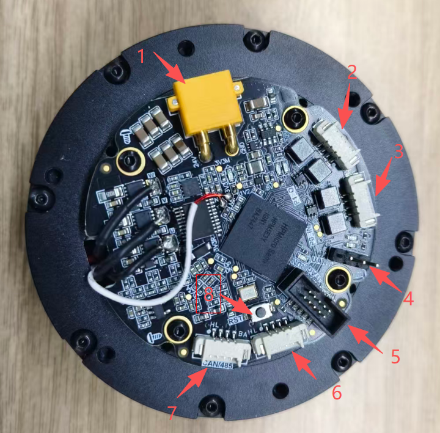

主要接口说明：
1、24V电源接口：电源供电，最大电流1A以上；
2、EtherCAT OUT：用于级联下一级的ECAT从站设备；
3、EtherCAT IN：连接上位机，本测试使用TwinCAT作为上位机；
4、UART串口，调试时使用，连接HPM Monitor上位机时使用；
5、JTAG接口，用于调试和烧录，测试时需要将boot固件通过此接口烧录到MCU；

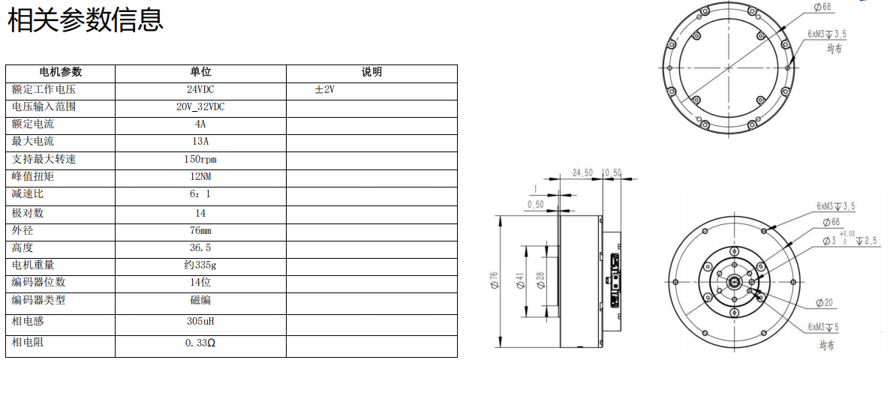

## 方案测试需要的软、硬件
用该方案前需要准备一些必要的硬件和软件。
1、先楫的SDK1.11.0和HPM APPS 1.11。
2、24V电源，最大电流1A以上。
3、接线准备：例程使用的电机型号为达妙DM-J6006-2EC，其中的EtherCAT IN接口通过转接线接网线，
然后连接到安装有TwinCAT软件的电脑,电机的接线如下图所示：

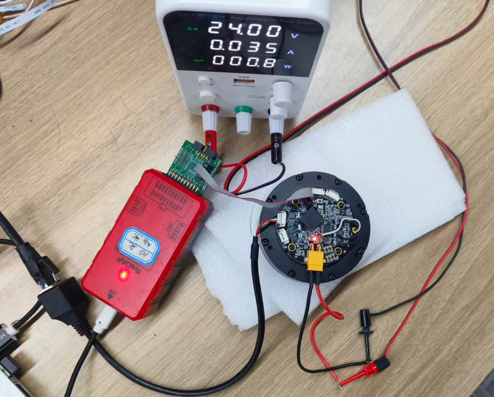

4、安装有TwinCAT和python环境（打包用户bin文件时用）的电脑；
5、网线一根；
6、JTAG调试器或TYPE-C线；
7、将ECAT_FOE_CIA402配置文件（在方案的tool文件夹中）放置到TwinCAT目录下：TwinCAT\3.1\Config\Io\EtherCAT。

## 软件工程结构

HPM6E_ROBOT_SERVO3.0方案的工程文件结构如下图所示：

其中doc文件夹内为方案的文档，包括设计方案和使用指南。hardware文件夹内是该方案的原理图。software文件夹内为方案的软件代码，包括bootuser和user_app等。tool文件夹内有串口助手、网络助手、固件打包工具（需要python环境）和本方案需要的xml配置文件。
图4-2所示为software文件夹目录结构，bootuser和user_app是两个独立的工程。
其中bootuser文件夹为非后台下载模式的固件升级功能的工程；
common文件夹内为两个工程的通用代码，包括enet、ethercat、usb和uart等，本方案的固件升级使用的是ethercat；
linker文件夹内是支持的芯片相关的linker文件，本方案使用的是HPM6E6Y芯片；
user_app文件夹内是用户使用的工程文件，用户增加/修改功能均在这个文件夹内操作。
## 测试

首先创建boot工程

### boot工程创建

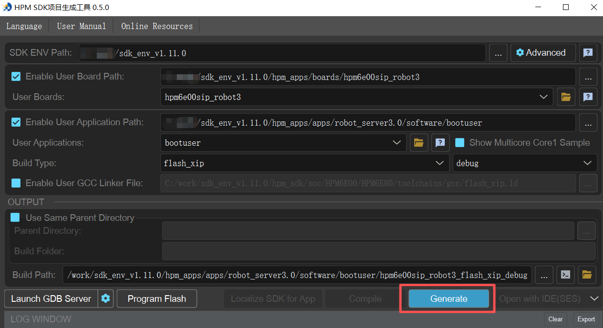

按照方案的功能，测试分为以下几个部分：

### FOE功能测试

（1）app工程创建

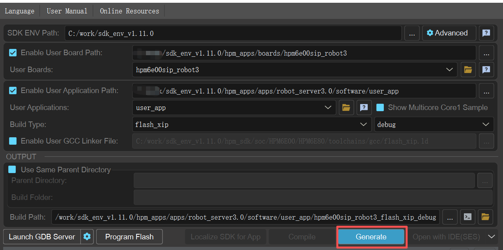

（2）制作升级包
将生成的app固件放到工程的tool\ota_pack_tool文件夹下，在ota_pack_tool文件夹内打开cmd命令窗口，
运行命令：python pack_ota.py 4 demo.bin update_sign.bin，打包后的bin文件为update_sign.bin。
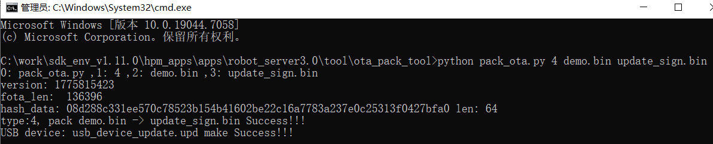

（3）使用TwinCat进行升级

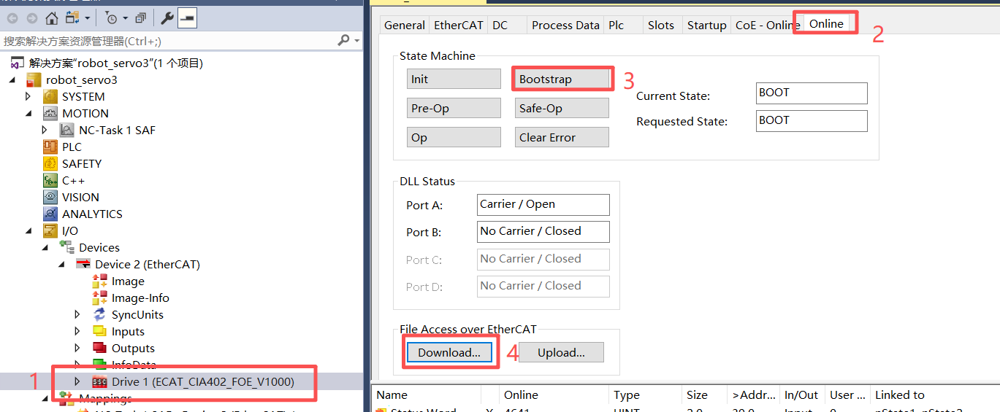

注意固件的名称必须为app，密码必须为87654321，不可更改为其他值。
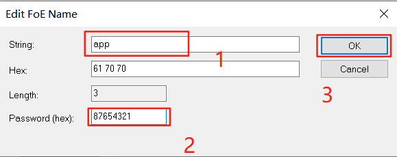

### CIA402功能测试

分为两个部分，CSV模式和CSP模式。

(1)CSV模式测试
设备与TwinCat上位机连接后，默认为CSV模式。设置好DC模式后，只需要设置好目标位置和目标速度即可。
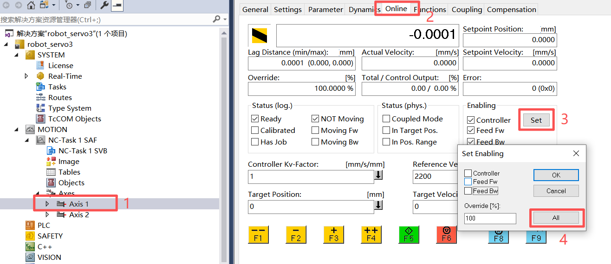
(2)CSP模式测试
从CSV切换到CSP模式后，需要重新链接设备并重新设置目标位置和目标速度。
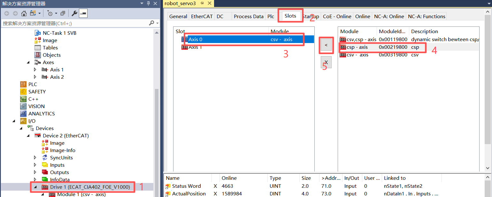
切换模式后重新链接设备如下图所示：
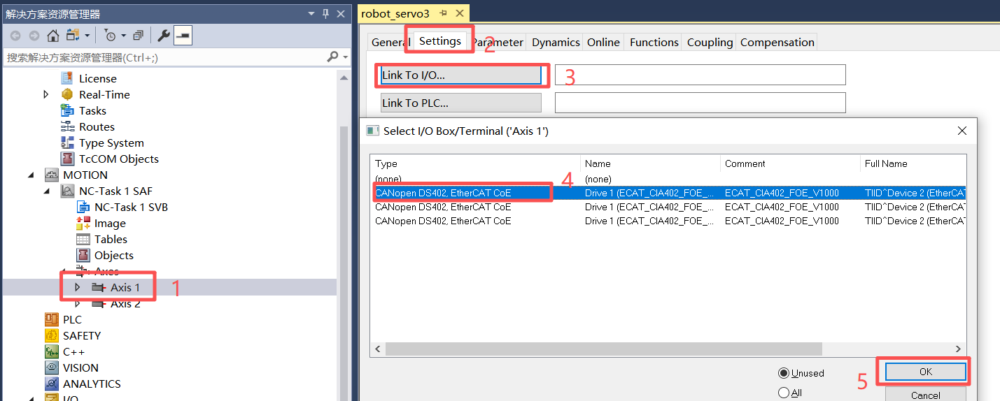

### 电流环参数整定测试

本功能的使用需要用JLINK或DAPLINK进行在线调试，将user_app工程下载到MCU后，把pmsm_init.c文件中的电机控制全局变量Motor_Control_Global添加到watch中，
修改结构体中的motor_CW为2。
在pmsm_detection.c文件中的pi_params_get函数最后打断点，点击运行按钮，待整定完成后将鼠标放到kp、ki的变量上即可看到整定结果，也可将结果通过串口打印出来。
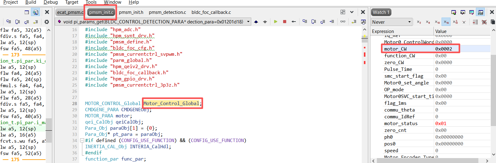

#### 惯量辩识功能测试

本功能的使用需要用JLINK或DAPLINK进行在线调试，首先将board.h中的宏定义MOTORCONTROL_EC_OR_STUDIO设置为1，屏蔽EtherCat功能。
将user_app工程下载到MCU后，把pmsm_init.c文件中的电机控制全局变量Motor_Control_Global添加到watch中，为了防止初始化过程对全局变量的修改，
先在pmsm_motor1_init函数的最后打断点，然后修改结构体中的motor_CW为1、OP_mode为1、Motor_Interia为1。
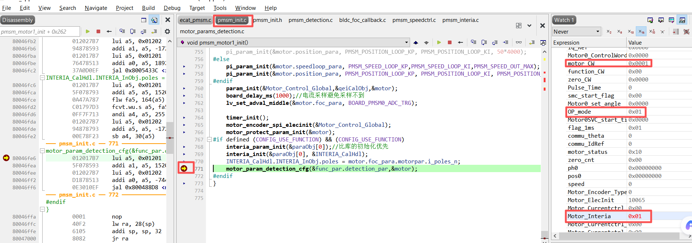
将pmsm_init.c文件中惯量辩识全局变量INTERIA_CalHdl添加到watch中，运行30s左右后在pmsm_interia.c文件中的motor_interiactrl函数最后打断点，
查看INTERIA_CalHdl变量即可看到惯量辩识的结果。

#### 3P3Z功能测试

本方案默认使用了3P3Z的功能，若用户不使用3P3Z功能，只需将board.h中的宏定义BOARD_PMSM0_CLC_3P3Z改为0即可。
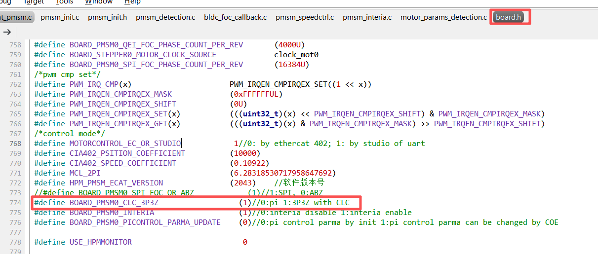

#### HPM Monitor功能测试
HPM Monitor是先楫半导体推出的一款MCU实时监测工具，可实时显示变量的值和动态曲线，并可修改变量的值。使用的HPM Monitor上位机版本HPMicroMonitorStudio1.2.1。
在bldc.h中将USE_HPMMONITOR宏定义改为1，默认为0。通过JTAG烧录新固件或者通过FOE升级固件。
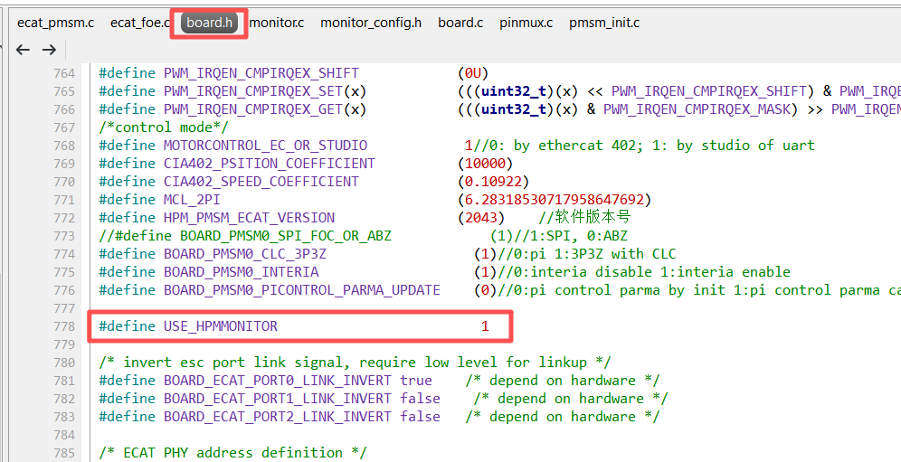
上位机通过UART与电路板连接。
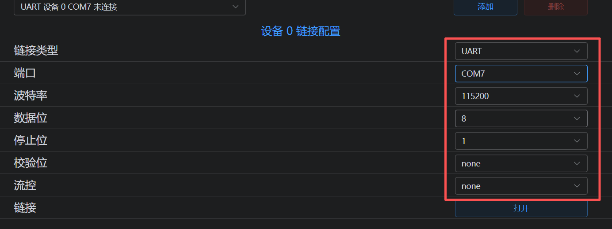

## API

:::{eval-rst}

关于软件API 请查看 `方案API 文档 <../../_static/apps/robot_servo3.0/html/index.html>`_ 。
:::
