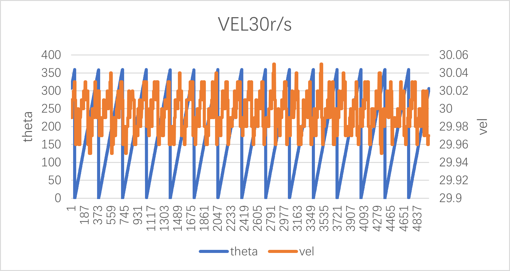

# HPM5300_RDC

## Depend on SDK1.10.0

## Overview

High performance motor control applications traditionally require a speed or position sensor for control loop feedback. The position feedback link has a critical impact on the performance of the system. Rotary transformers have become popular Angle sensors due to their advantages such as impact resistance, high temperature resistance, oil pollution resistance, high reliability, and long life.

At present, most of the existing rotary solutions in the market are discrete, with high BOM cost and large board area.

In order to simplify the design, HPM provides a functional rotary decode board integrating excitation op amp circuit, boost DC-DC chip, analog front end, rotary digital converter, rotary signal loss detection and multiple format data (position/speed) output interface.

## hardware solution

HPM5300RDC board has the following functions: two ADC, one uart, one spi, two DAC, QEO output, SEI master/slave, LED display, etc.

HPM5300RDCschematic diagram: [《HPM5300_RDC_REVB》](hardware/00_原理图/HPM5300RDCRevB.pdf)

### software solution

The software solution is mainly composed of the following parts:

pwm generates the excitation signal, ADC samples it, and takes the envelope.

### TEST

This scheme is divided into two parts:

(1) Hardware test: pwm modulated sinusoidal differential signal (EXC_P/EXC_N), rotary sinusoidal winding signal (OSIN/OCOS)
(2) Functional test: Angle and speed observation

### test instrument

（1）Motor drive platform

（2）hHPM5300RDC

### testing environment

(1)HPM_RDC decoding software: soft_rdc
(2) ozone
(3) Jlink
(4) RDC board pin description
| function |rotary plate location | note | 
| ---- | ---- | ---- | 
| EXC+ | J4[5] | rotary exc signal | 
| EXC- | J4[6] | rotary exc signal | 
| COS+ | J4[1] | rotary cos signal | 
| COS- | J4[2] | rotary cos signal | 
| SIN+ | J4[3] | rotary sin signal | 
| SIN- | J4[4] | rotary sin signal | 
| PWR  | J3[5] | 24v,150mA| 
| GND  | J3[4] | GND | 
|OEXC  | R17   |  |
|PWM   |R16    |  |
|sin   |R16    |  |

### creat project

### hardware test

（1）static state：

- connect  rotary signal to RDC

- open the hardware_rdc project

- Connect the debugger to the JTAG interface

- Run the program

- measure key signals by oscilloscope:

pwm modulated sinusoidal differential signal：EXC_P(yellow)，EXC_N(pink)

Sinusoidal differential signal after the amplifier output signal: EXC+,EXC-

OSIN(yellow)，OCOS(pink)

Differential EXC+- Transfer single end :OEXC(pink), osin(yellow)

(2)In motion：

- connect  rotary signal to RDC

- Create and open the soft_rdc project

- Connect the debugger to the JTAG interface

- Run the program

- move the motor manually

- measure key signals by oscilloscope:

OSIN(yellow)，OCOS(pink)

(3)1MhzSVPWM

(4)1MhzADC sample

(5)envelope curve sin/cos

## theta/speed calculate

(1)vel10r/s

(2)vel20r/s

(3)vel30r/s

(4)vel40r/s

(5)vel50r/s

## API

:::{eval-rst}

About software API: `API doc <../../_static/apps/soft_rdc/html/index.html>`_ .
:::
