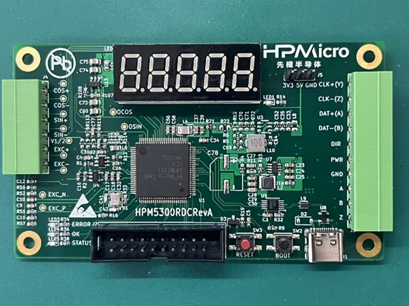
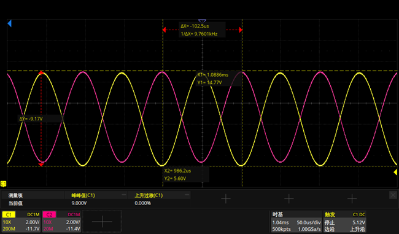
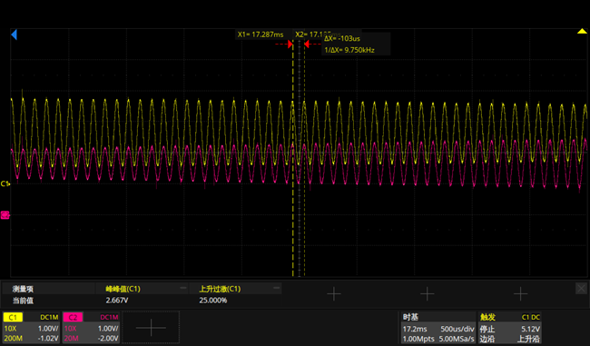
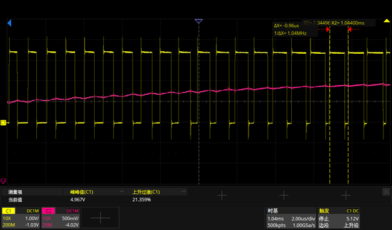
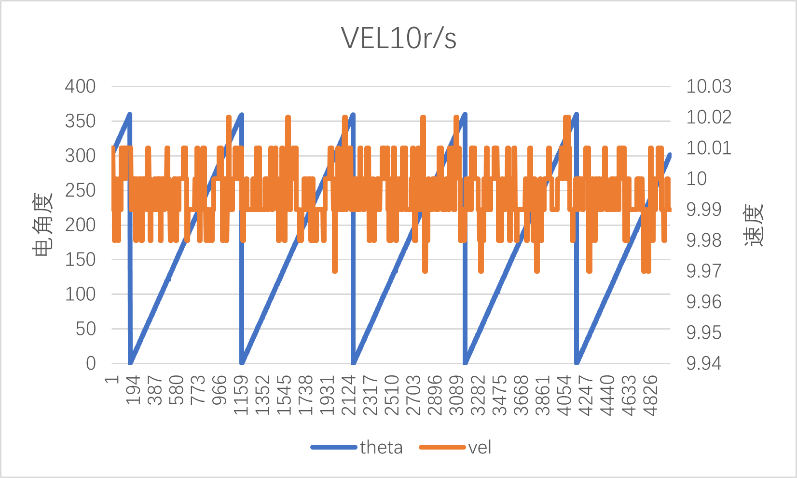

# HPM5300_RDC软解码

## 依赖SDK1.10.0

## 概述

高性能电机控制应用传统上需要一个速度或位置传感器的控制回路反馈。位置反馈环节对系统的性能有关键性的影响。旋转变压器因其耐冲击，耐高温，耐油污，高可靠，长寿命等优点，成为受欢迎的角度传感器。

目前，市场现有的旋变解决方案多为分立式，BOM成本高，占板面积大。

为了简化设计，HPM提供了集励磁运放电路，升压DC-DC芯片，模拟前端，旋变数字转换器，旋变信号丢失检测以及多种格式数据（位置/速度）输出接口于一体的功能型旋变解码板。

## 硬件方案

HPM5300RDC板具有的功能有：两路ADC，一路uart，一路spi,两路DAC，QEO输出，SEI主/从，LED显示等。

HPM5300RDC原理图: [《HPM5300_RDC_REVB》](hardware/00_原理图/HPM5300RDCRevB.pdf)

## 软件方案

软件方案主要由以下几部分组成：

pwm产生激励信号，ADC采样，取包络线。

## 测试

本方案测试分为两大部分：

（1）硬件测试：pwm调制后正弦差分信号(EXC_P/EXC_N)，旋变正余弦绕组信号(OSIN/OCOS)
（2）功能测试：角度、速度观测

### 测试仪器

（1）电机驱动平台

（2）旋变解码板

### 测试环境

(1)HPM_RDC解码软件：soft_rdc
(2) ozone调试工具
(3) Jlink
(4) RDC板引脚说明

| 功能 | 旋变板位置| 说明 | 
| ---- | ---- | ---- | 
| EXC+ | J4[5] | 旋变激励信号 | 
| EXC- | J4[6] | 旋变激励信号 | 
| COS+ | J4[1] | 旋变输出余弦信号 | 
| COS- | J4[2] | 旋变输出余弦信号 | 
| SIN+ | J4[3] | 旋变输出正弦信号 | 
| SIN- | J4[4] | 旋变输出正弦信号| 
| PWR  | J3[5] |  24v,150mA| 
| GND  | J3[4] |  接地| 
|OEXC  | 电阻R17|  |
|PWM   |电阻R16|   |
|sin   |电阻R16|   |

### 工程创建

### 硬件测试

（1）静态下：

- 旋变板接入旋变信号

- 打开soft_rdc工程

- 连接调试器到JTAG接口

- 运行程序

- 示波器测量关键信号：

pwm调制后正弦差分信号：EXC_P(黄)，EXC_N(粉红)

正弦差分信号经过放大器之后输出信号：EXC+,EXC-

旋变正弦/余弦绕组信号

差分EXC+-转单端:OEXC(粉红)，osin(黄)

(2)动态下：

- 旋变板接入旋变信号
- 创建，打开soft_rdc工程
- 连接调试器到JTAG接口
- 运行程序
- 手动旋转电机
- 示波器测量关键信号：

OSIN(黄)，OCOS(粉红)

(3)1MhzSVPWM

(4)1MhzADC采样

(5)包络线提取

## 角度/速度计算

(1)速度10r/s的情况下，角度与速度输出

(2)速度20r/s的情况下，角度与速度输出

(13)速度30r/s的情况下，角度与速度输出

(4)速度40r/s的情况下，角度与速度输出

(5)速度50r/s的情况下，角度与速度输出

## API

:::{eval-rst}

关于软件API 请查看 `方案API 文档 <../../_static/apps/soft_rdc/html/index.html>`_ 。
:::
