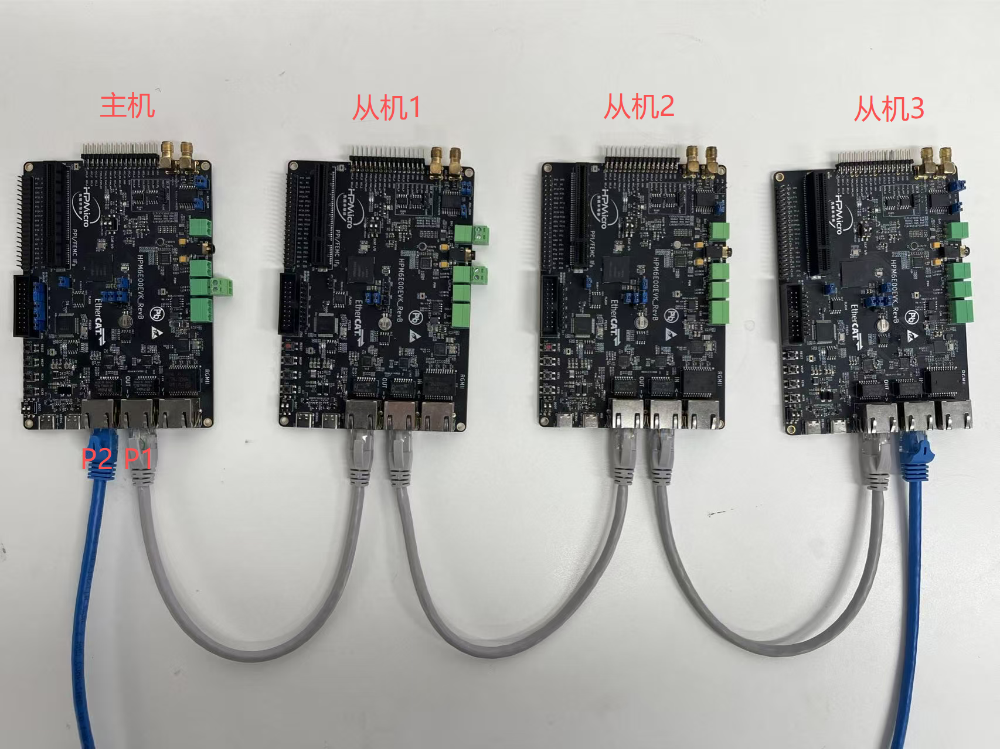

# HPM TSN环网通信方案

## 依赖SDK1.10.0

## 概述

本例程使用HPM6E系列芯片的TSN功能，通过TSN的CB协议及switch功能实现环网及硬件转发，转发延迟微秒级。

## HPM6E00EVK环网组网拓扑结构


例程说明：
1. 整个系统中只有一个主机，其它都是从机。主机或从机硬件均使用HPM6E00EVK开发板，通过网线将IN OUT两个网口连接成环。
2. 每个主机或从机设备只有一个MAC地址，且MAC地址不可重复
3. 每个主机或从机设备只有一个IP地址，且IP地址不可重复，同时所有设备必须在一个网段下。
4. 主机建立一个udp server, bind的是IP_ADDR_ANY，即任意地址，端口号可以通过宏配置。从机建立一个udp client, 端口号既可以固定(bind)也可以不固定。
5. HPM6E系列芯片的TSN功能包括三个外部端口和一个内部端口，HPM6E00EVK开发板上的IN OUT网口分别对应TSN的两个外部端口P1,P2。本例程使用一个内部端口和两个外部端口。
   主机端配置，广播帧可以从内部端口转发出去，未知帧可以从P1 P2口转发出去，内部帧不允许转发。同时配置lookup表，目的地址为本机MAC地址的帧可以从内部端口转发出去。
   从机端配置，广播帧可以从P1 P2口转发出去，未知帧可以从P1 P2口转发出去，内部帧不允许转发。同时配置lookup表，目的地址为本机MAC地址的帧可以从内部端口转发出去。
   这两种配置保证，ARP为单向，且不会产生广播风暴，并且降低内部端口的压力，即降低CPU的压力。
6. 主机或从机发送数据时，CB功能会将数据帧打上r-tag，同时从两个外部端口发送出去。接收数据时，如果接收到相同的帧，switch功能会将其丢弃。保证内部端口只接收到一帧有效数据，而不会接收相同帧数据
7. 通信逻辑，上电后，udp client发送一帧数据，主机收到后记录此时client的IP地址及端口号，并通知client停止发送，默认可以存16个从机信息，即串联16个从机设备。此时主机开始按定时器中断给从机发送，默认1ms发送一帧数据。
8. 从机接收到1000个数据帧后，RGB变换一次状态，通过观察RGB灯的状态，确认从机接收数据速率。
9. 主机发出数据到从机3收到数据历经21us，其中包括3个转发延迟，3个传输线延迟及MCU的处理延迟等。


## 例程说明 

### 环境

#### SDK版本

V1.10.0

#### BOARD

HPM6E00EVK_RevB

### 软件配置

#### A. 软件说明

tsn_loopnet_master: 主机端程序
tsn_loopnet_slave: 从机端程序

#### B. 主机或从机MAC及IP地址修改

netconf.h中修改IP地址及MAC地址第5位。

默认主机IP地址及MAC地址第5位：
```
#ifndef IP_CONFIG
#define IP_CONFIG 192.168.100.10
#endif
#define MAC5 0x40
```
默认从机IP地址及MAC地址第5位：
```
#ifndef IP_CONFIG
#define IP_CONFIG 192.168.100.11
#endif
#define MAC5 0x41

#ifndef IP_CONFIG
#define IP_CONFIG 192.168.100.12
#endif
#define MAC5 0x42

#ifndef IP_CONFIG
#define IP_CONFIG 192.168.100.13
#endif
#define MAC5 0x43
```
#### C. 主机或从机端口修改

udp_echo.h中修改主机端口

默认主机端口：
```
#ifndef UDP_LOCAL_PORT
#define UDP_LOCAL_PORT (5000U)
#endif
```
从机端口在udp_client.h中修改：
默认从机端口：
```
#ifndef UDP_LOCAL_PORT
#define UDP_LOCAL_PORT (5001U)
#endif
#ifndef UDP_LOCAL_PORT
#define UDP_LOCAL_PORT (5002U)
#endif
#ifndef UDP_LOCAL_PORT
#define UDP_LOCAL_PORT (5003U)
#endif
```

注意：
1. 确保主机以及每个从机的IP地址和MAC地址不同，不可重复；
2. 主机和所有从机必须在同一网段下，否则无法通信。

## 测试

1. 按以上配置，主机和从机均上电，主机会自动检测到所有从机，并记录从机IP地址及端口号。同时每隔1ms给从机发送一帧数据。对应从机接收到1000个数据后，会变换一次RGB状态。

2. 断开测试，断开其中一根网线，通信依然正常。

注意:
本例程检测phy连接状态只检测了P2口状态，断开测试时，不能断开P2口网线，否则会导致从机直接掉线。

## API

:::{eval-rst}

关于软件API 请查看 `方案API 文档 <../../_static/apps/tsn_loopnet/html/index.html>`_ 。
:::
