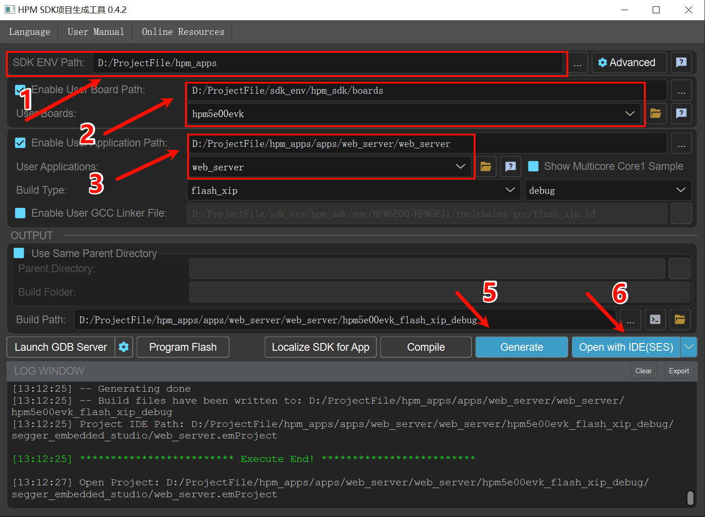
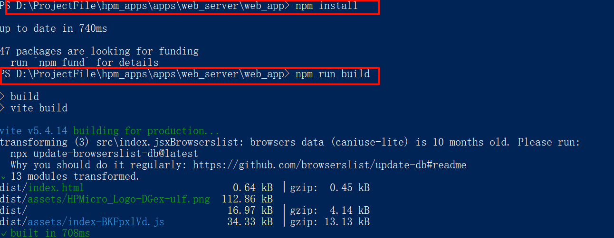
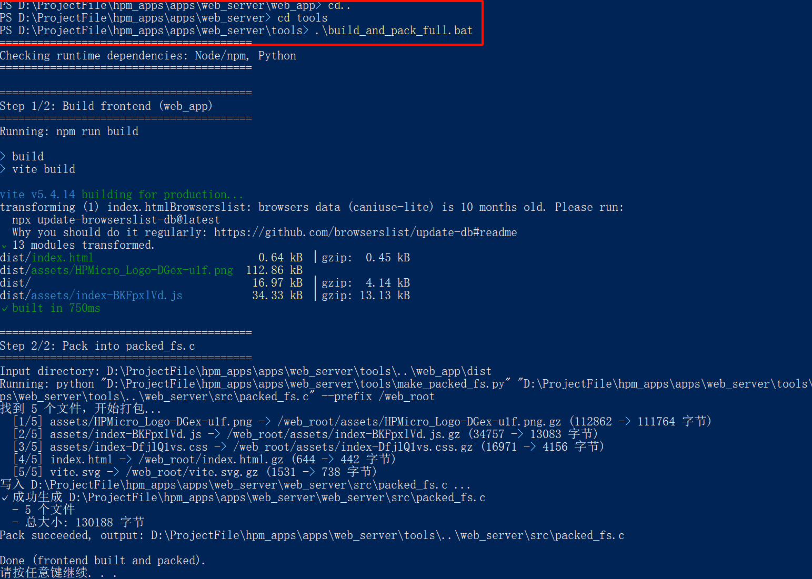
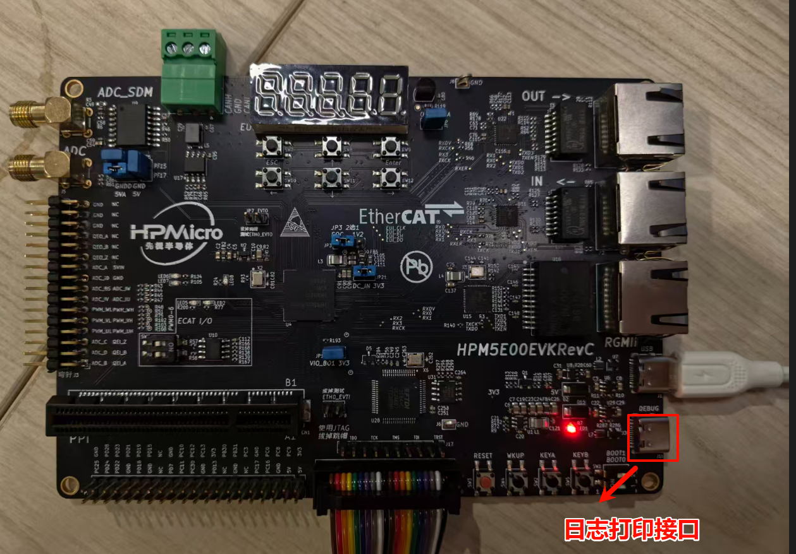
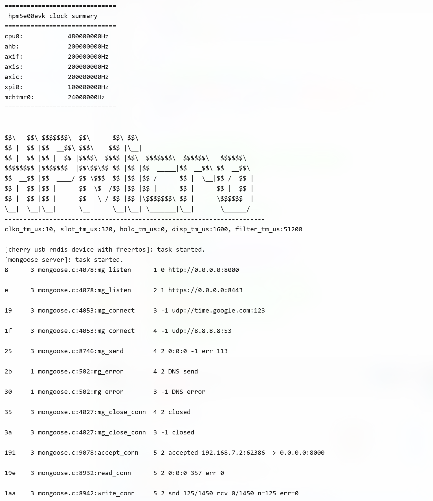
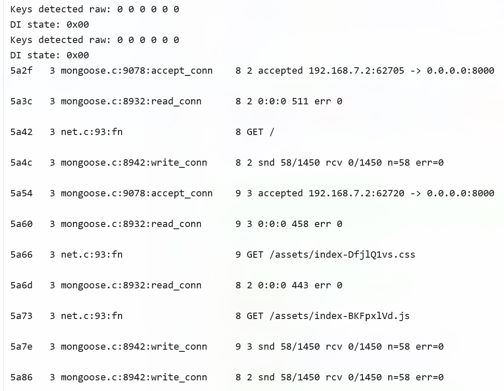

# HPM5E00EVK Web 控制系统

## 概述

HPM5E00EVK Web 控制系统是一个基于HPMicro HPM5E00 RISC-V微控制器的嵌入式Web服务器项目。该项目通过USB RNDIS虚拟网卡技术,实现了无需外部网络连接即可通过浏览器访问和控制开发板的功能。

## 依赖 SDK版本V1.10.0

### 主要特性

- **USB RNDIS网络** - 通过USB实现虚拟以太网连接,即插即用
- **嵌入式Web服务器** - 基于Mongoose的轻量级HTTP服务器
- **实时控制界面** - 使用Preact构建的现代化Web UI
- **数字量输入监控** - 实时显示6路按键状态
- **数码管显示控制** - 通过Web界面控制单个8段数码管
- **RESTful API** - 提供标准化的HTTP API接口

### 技术架构

**后端 (web_server/)**

- **RTOS**: FreeRTOS
- **网络协议栈**: LwIP (轻量级TCP/IP协议栈)
- **USB协议**: CherryUSB RNDIS设备类
- **Web服务器**: Mongoose (嵌入式HTTP服务器)
- **外设控制**: EUI (扩展用户接口) - 数码管和按键矩阵

**前端 (web_app/)**

- **框架**: Preact (轻量级React替代方案)
- **构建工具**: Vite
- **样式**: Tailwind CSS
- **打包方式**: 构建后转换为C数组嵌入固件

## 项目结构

```
HPM5E00-Web/
├── web_server/               # 嵌入式服务器代码
│   ├── app/                  # 应用主程序
│   │   ├── main.c           # 程序入口
│   │   ├── init.c/.h        # 硬件和网络初始化
│   │   ├── tasks.c/.h       # FreeRTOS任务管理
│   │   └── interrupts.c/.h  # 中断服务程序
│   ├── button/              # 按键和数码管控制
│   │   └── button.c/.h      # EUI外设驱动
│   ├── net/                 # 网络服务
│   │   └── net.c/.h         # Mongoose HTTP服务器和API
│   ├── rndis/               # USB RNDIS设备
│   │   └── cdc_rndis_device.c/.h
│   ├── fs/                  # 嵌入式文件系统
│   │   └── packed_fs.c      # 打包的前端资源
│   ├── config/              # 配置文件
│   │   ├── FreeRTOSConfig.h
│   │   ├── lwipopts.h       # LwIP配置
│   │   └── mongoose_config.h
│   └── common/              # 公共组件
│       ├── arch/            # LwIP架构适配
│       ├── dhcp-server/     # DHCP服务器
│       ├── dns-server/      # DNS服务器
│       └── mongoose/        # Mongoose源码
├── web_app/                 # Web前端应用
│   ├── src/
│   │   ├── app.jsx          # 应用主组件
│   │   ├── pages/
│   │   │   └── Welcome.jsx  # 主页面
│   │   └── assets/          # 静态资源
│   ├── dist/                # 构建输出目录
│   └── package.json
├── tools/                   # 工具脚本
│   ├── build_and_pack_full.bat  # 一键构建和打包脚本
│   └── make_packed_fs.py    # 前端资源打包工具
└── doc/                     # 文档
```

## 快速开始

### 硬件要求

- HPM5E00EVK 开发板
- USB数据线(连接到PC)
- (可选)调试器(用于固件烧录和调试)

### 软件要求

**后端开发**

- Segger Embedded Studio (SES)
- HPM SDK v1.10.0
- CMake 3.13+

**前端开发**

- Node.js 16+ 
- npm 或 yarn

### 开发板连接方式


### 构建项目
 

### 编译和运行

#### 1. 构建前端应用
在web_app文件夹下右键，打开windows powershell

```bash
npm install
npm run build
```



#### 2. 打包前端资源到C文件

使用一键脚本:

```bash
cd ..
cd tools
build_and_pack_full.bat
```


#### 3. 编译固件

使用SES打开项目:

#### 4. 烧录和运行

1. 将固件烧录到HPM5E00EVK开发板
2. 通过USB连接开发板到PC,注意要连接到USB口，debug口用于日志打印

3. PC会识别出虚拟网卡并自动获取IP地址(192.168.7.x)
4. 打开浏览器访问: `http://192.168.7.1:8000`

## 运行现象

### 串口日志
未打开web页面串口日志

打开web页面串口日志


### Web界面功能

1. **设备状态显示**

   - 左上角显示"HPM5E00EVK 开发板"和在线状态
   - 在线时状态指示灯为绿色并闪烁

2. **MCU核心亮点展示**

   - 显示5个特性卡片:强劲内核、工业互联核心、精准运动控制、高集成度、安全可靠
   - 悬停时有扫描线动画效果

3. **数字量输入监控**

   - 实时显示6路按键状态(IN1-IN6)
   - 按下开发板上的物理按键,对应的按钮指示器将实时点亮(显示为1)
   - 松开按键后熄灭(显示为0)
   - 更新周期:200ms

4. **数码管显示控制**

   - 提供0-9共10个数字按钮
   - 点击数字按钮,开发板上的数码管将显示对应数字
   - 点击后按钮会高亮1秒

### 串口输出

连接串口调试终端(115200, 8N1),可以看到:

```console
Web Server Starting...
IP Address: 192.168.7.1
HTTP Server: http://192.168.7.1:8000
```

按键按下时会输出按键状态信息。

## API接口

### 1. 心跳检测

```
GET /api/heartbeat
Response: {"status": "ok", "uptime": 12345}
```

### 2. 数字量输入状态

```
GET /api/di
Response: {"digitalInputs": 5}  // 位掩码,bit0-bit5对应IN1-IN6
```

### 3. EtherCAT数据

```
GET /api/ethercat/data
Response: {
  "digitalInputs": 5,
  "digitalOutputs": 0,
  "syncPeriod": 0,
  "syncMode": "FreeRun",
  "slaveALStatus": "INIT"
}
```

### 4. 数码管控制

```
POST /api/segment-display
Content-Type: application/json
Body: {"digit": 5}  // 显示数字0-9
Response: {"status": "ok"}
```

## 网络配置

- **设备IP地址**: 192.168.7.1
- **子网掩码**: 255.255.255.0
- **HTTP端口**: 8000
- **DHCP服务器**: 自动为PC分配192.168.7.2-192.168.7.254的IP地址
- **DNS服务器**: 内置DNS服务器,解析所有域名到192.168.7.1


## 故障排除

### PC无法获取IP地址

- 检查USB连接是否正常
- 在设备管理器中查看是否有RNDIS设备
- 手动设置PC网卡IP为192.168.7.2,子网掩码255.255.255.0

### 无法访问Web界面

- 确认设备IP为192.168.7.1
- 检查防火墙设置
- 尝试使用 `ping 192.168.7.1` 测试连通性

## 注意事项
- 代码运行过程中，电脑处于断网状态，因为此时RNDIS 虚拟网卡成为默认网关。如果想要恢复上网功能，需要断开USB连接。

## API

:::{eval-rst}

关于软件API 请查看 `方案API 文档 <../../_static/apps/web_server/html/index.html>`_ 。
:::