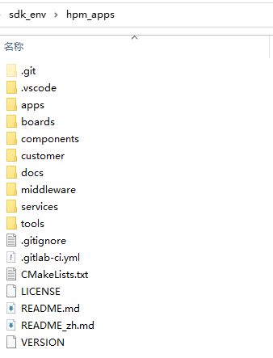

# Introduction

## HPM APPS introduction
HPM APPS is an upper layer application software development kit based on HPM SDK. It provides a variety of typical general-purpose application solutions, including middleware, components, services, etc., for users to use and evaluate.

## HPM APPS directory structure

| Directory name | Description |
|--------|--------|
| <HPM_APP_BASE>/boards | Files for various development boards |
| <HPM_APP_BASE>/components | Software components |
| <HPM_APP_BASE>/docs | Document |
| <HPM_APP_BASE>/middleware | Middleware |
| <HPM_APP_BASE>/apps | Samples of various solutions |
| <HPM_APP_BASE>/services | Software Services |
| <HPM_APP_BASE>/tools | Tool files |

## apps project directory structure

| Directory name | Description |
|--------|--------|
| doc | Documentation, including api documentation and documentation resources |
| hardware | Hardware information for the project |
| software | software |
| tool | Script and other tools |
| README_en.md | English markdown |
| README_zh.md | Chinese markdown |

## HPM APPS announcements
- HPM APPS should be used in conjunction with HPM SDK, and the versions of HPM APPS and HPM SDK correspond one-to-one. Please refer to [Usage Instructions](hpm_app_instruction_zh) for details.
- In order to better serve users, the HPM APPS software API has specially added Chinese notes, which often cause garble due to character encoding problems when opened, so it should be opened with **uft-8** character encoding format for reference.

