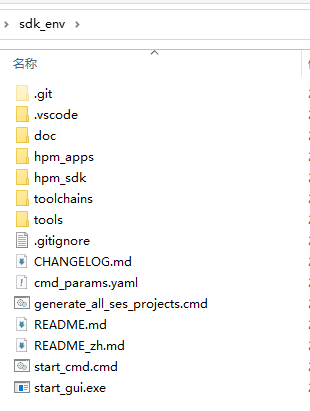
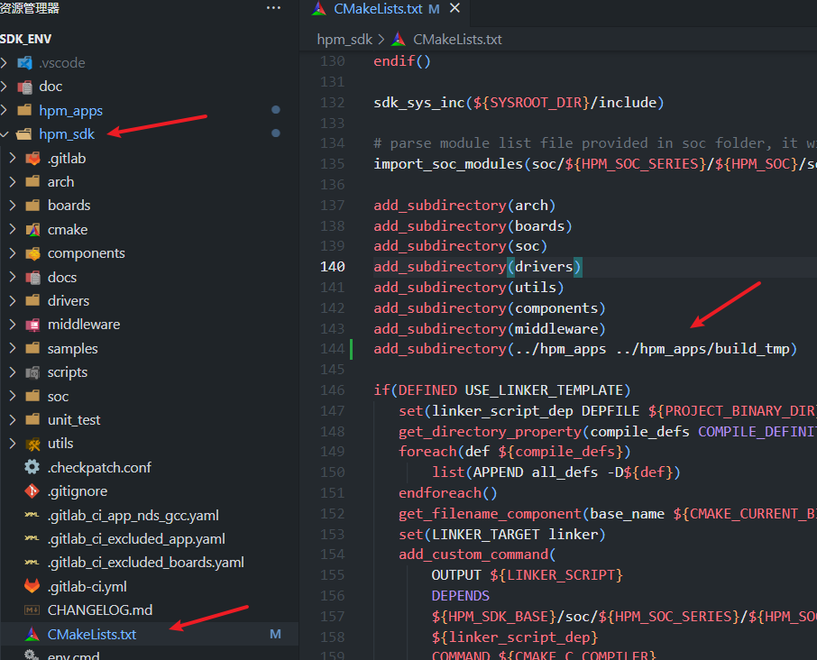
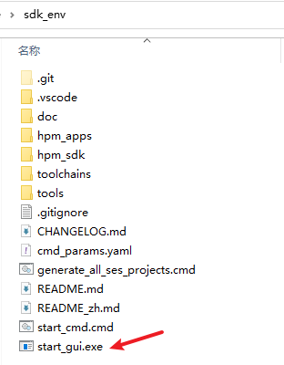
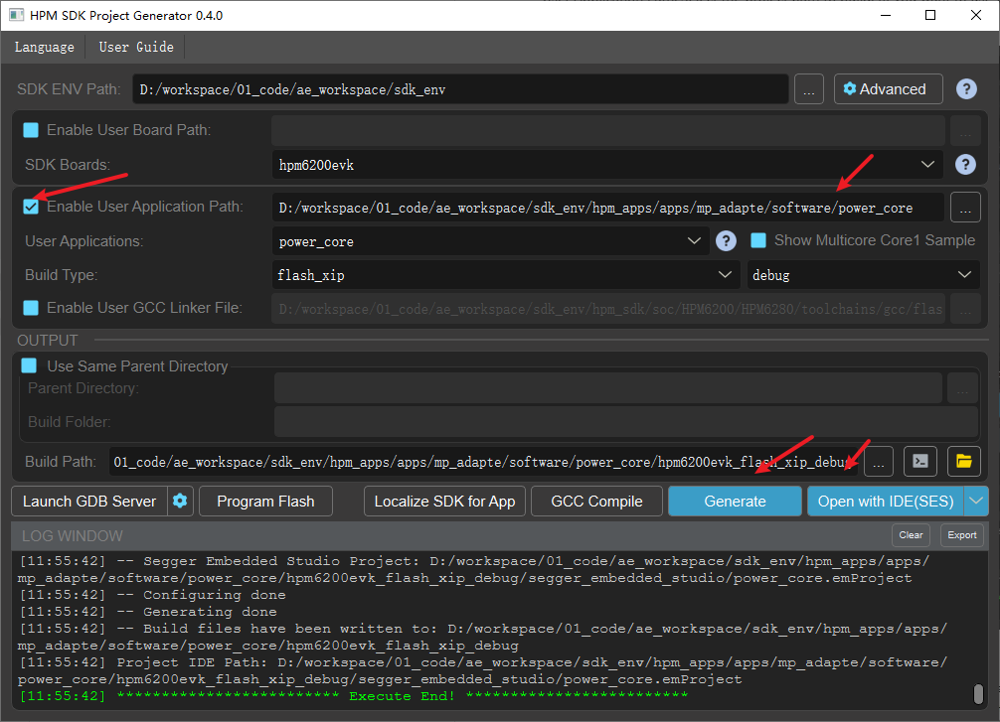
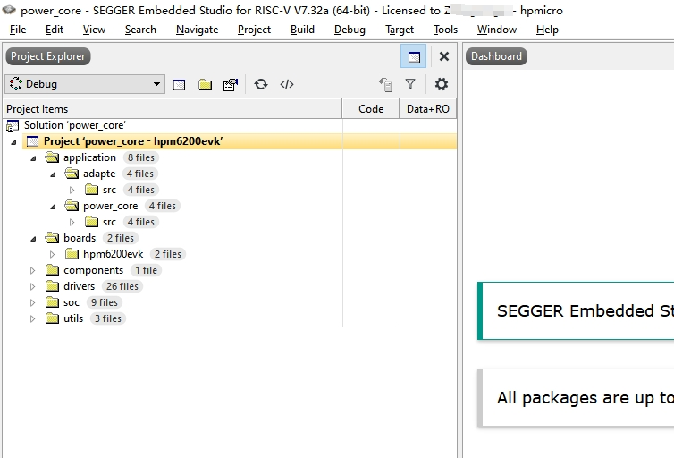

# Instructions for using the HPM APPS

## HPM SDK version requirements
(hpm_app_instruction_zh)=

The versions of HPM APPS and HPM SDK correspond one-to-one. To maintain version compatibility, the version number should be the same.
For example:
| Software Name | Version |
|--- | --- |
| hpm_sdk | 1.4.0 |
| hpm_apps | 1.4.0 |

## Installation
- Note1:Put the hpm_apps and hpm_sdk in the same directory:


- Note2:To modify the CMakeLists.txt file in the hpm_sdk directory, add hpm_apps to the project subdirectory (if hpm_sdk has been added, ignore it):

Path：hpm_sdk/CMakeLists.txt
    ```shell
    add_subdirectory(../hpm_apps ../hpm_apps/build_tmp)
    ```

## Build
- Windows:
    Using the env environment in Windows, you can use the GUI tool to build the project and the IDE SEGGER Embedded Studio for RISV-V to build and debug the project.
    - Generate projects using Windows GUI tools:
        
        Double-click to run the GUI tool:

        

        User Application Path: Select the project path to build.
        (If you want to use your own board，enable User Board Path)

        

       Build and debug with SES
        


- Linux:
    In Linux, add the HPM_SDK_BASE path to the environment variable. Add it manually or by running a command.
    
    1.Add the HPM_SDK_BASE path to the environment variable by running the command:
    ```shell
      cd hpm_sdk/
      source env.sh
    ```
    2.Go to the apps directory that you want to build and compile, and use the build and compile command.
    for example：
    ```shell
    //Switch to the sample application directory
    cd hpm_apps\apps\mp_adapte\power_core2
    //Create build directory
    mkdir build
    //Switch directory to "build"
    cd build
    //Ninja-build:Generate build file
    cmake -GNinja -DBOARD_SEARCH_PATH=/home/work/workspace/hpm_apps/boards -DBOARD=hpm6200power -DCMAKE_BUILD_TYPE=flash_xip ..
    //build
    ninja
    ```
    After compilation is completed, the generated ELF and corresponding files can be found in the output directory.
