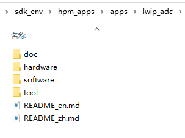

# 介绍

## HPM APPS 介绍
HPM APPS是基于HPM SDK开发的上层应用软件开发套件。提供各种典型通用的应用解决方案，包含了中间件、组件、服务等，供用户使用评估。

## HPM APPS 目录结构

| 目录名称 | 描述 |
|--------|--------|
| <HPM_APP_BASE>/boards | 各类方案板级文件 |
| <HPM_APP_BASE>/components | 软件组件 |
| <HPM_APP_BASE>/docs | 文档 |
| <HPM_APP_BASE>/middleware | 中间件 |
| <HPM_APP_BASE>/apps | 各类方案实例 |
| <HPM_APP_BASE>/services | 软件服务 |
| <HPM_APP_BASE>/tools | 工具类文件 |

## apps工程目录结构

| 目录名称 | 描述 |
|--------|--------|
| doc | 文档，包括api文档及文档资源 |
| hardware | 工程硬件资料 |
| software | 软件工程 |
| tool | 脚本等工具 |
| README_en.md | 英文markdown |
| README_zh.md | 中文markdown |

## HPM APPS使用注意事项
- HPM APPS需搭配HPM SDK使用，且HPM APPS和HPM SDK版本一一对应。详细查看[使用说明](hpm_app_instruction_zh)。
- HPM APPS软件API为了更好的服务用户，特意增加了中文的注释，在打开时常常会出现因字符编码的问题导致乱码，因此必须用**uft-8**字符编码格式打开后查阅。
