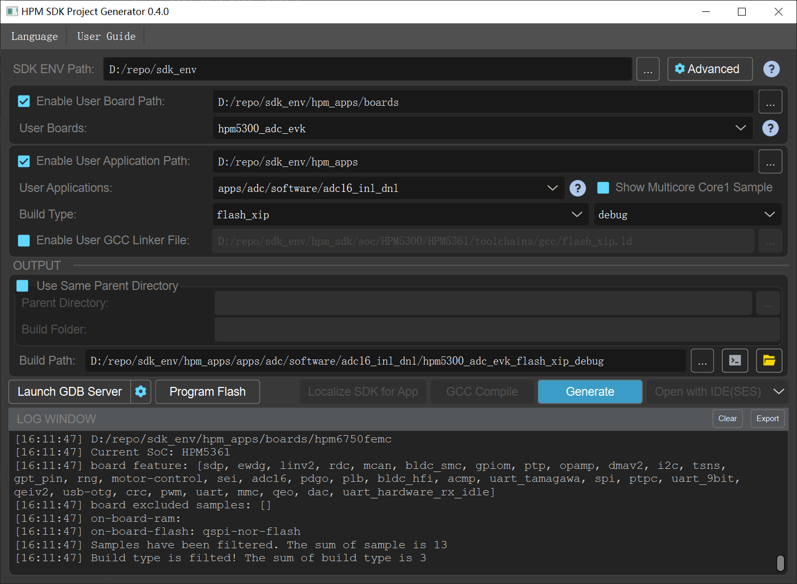

# 概述
HPM_APPS是基于HPM SDK开发的上层应用软件开发套件。支持各类系统级闭环方案，包含了中间件、组件、服务等，供用户使用评估。

## HPM_APPS 目录结构

| 目录名称 | 描述 |
|--------|--------|
| <HPM_APP_BASE>/boards | 各类方案板级文件 |
| <HPM_APP_BASE>/components | 软件组件 |
| <HPM_APP_BASE>/docs | 文档 |
| <HPM_APP_BASE>/middleware | 中间件 |
| <HPM_APP_BASE>/apps | 各类方案实例代码 |
| <HPM_APP_BASE>/services | 软件服务 |
| <HPM_APP_BASE>/tools | 工具类文件 |

## HPM_APPS使用说明

### 依赖HPM SDK版本要求

HPM APP版本和HPM SDK版本一一对应，为了保持版本兼容，版本号必须相同。
例如：
| 软件名称 | 版本号 |
|--- | --- |
| hpm_sdk | 1.x.y |
| hpm_apps | 1.x.y |


### 构建编译

推荐在 Windows下使用 sdk_env 环境，构建 SES 编译调试工程。在 SDK ENV 工具中勾选 **Enable User Application Path** 并选择 **hpm_apps/apps** 目录即可，或者选择到自己需要用的 demo 目录，推荐使用前者，可以扫描所有 demo 文件。



如果需要增加 hpm_apps/middleware 中的相关中间件，请在 demo 下的 CMakeLists.txt 文件中增加以下代码, 推荐放在 `generate_ses_project` 之前,举例如下：

```
add_subdirectory(../../.. hpm_apps/build_tmp)
generate_ses_project()
```

## HPM_APPS文档
- 本地文档:
  HPM_APPS文档可以进行本地编译，成功编译之后可以通过以下入口访问本地文档:
  - <HPM_APP_BASE>>/docs/index.html
  - <HPM_APP_BASE>>/docs/index_zh.html

- 在线文档:
  - https://hpm-apps.readthedocs.io/en/latest/
  - https://hpm-apps.readthedocs.io/zh-cn/latest/

## 代码仓库
- hpm_apps github: https://github.com/hpmicro/hpm_apps
- hpm_sdk github: https://github.com/hpmicro/hpm_sdk
- sdk_env github: https://github.com/hpmicro/sdk_env
- sdk extra demo: https://github.com/hpmicro/hpm_sdk_extra
- openocd (hpmicro patched): https://github.com/hpmicro/riscv-openocd
- gnu gcc toolchain: https://github.com/hpmicro/riscv-gnu-toolchain

> 仓库在gitee上有对应的镜像。
