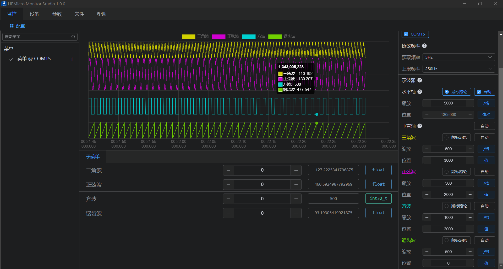

# hpm_monitor

[English](./README.md)

(hpm_monitor_instruction_zh)=

## 简介

hpm_monitor 是一个高效的、易用的、可移植性高的服务，用来实时查看和设置当前设备中的全局变量，或者用来高速(1Khz-1ms)上报全局变量；常常被用来当做监控数据示波器使用；对电机、电源等调试非常友好；

hpm_monitor服务 需搭配PC上位机HPMicroMonitorStudio工具使用，HPMicroMonitorStudio工具详细使用方法请参考工具帮助文档，本文不做介绍。
运行效果:


## 特点

- hpm_monitor 可移植性高，只需适配相关通信port即可。
- hpm_monitor 调用简单，只有两个接口，只需调用init和handle轮询即可，对原始工程逻辑无任何修改。
- hpm_monitor 通信协议轻量级、易扩展。
- 支持主动获取(GET)和设置(SET) 全局变量。
- 主持高速上报(Notify) 全局变量。

## 使用方法

hpm_monitor 服务调用简单，只需要在初始化时调用monitor_init()，并在主循环中轮询monitor_handle()即可完成当前工具的启用。

### APPS CMakeLists.txt启用当前工具
CMakeLists.txt 参考

``` C

cmake_minimum_required(VERSION 3.13)

# 启动HPMMONITOR
set(CONFIG_A_HPMMONITOR 1)
# 使能UART port
set(CONFIG_MONITOR_INTERFACE "uart")
# 使能USB port
# set(CONFIG_MONITOR_INTERFACE "usb")

if("${CONFIG_MONITOR_INTERFACE}" STREQUAL "uart")

elseif("${CONFIG_MONITOR_INTERFACE}" STREQUAL "usb")
# 使用USB port 后需启用一下
    set(CONFIG_CHERRYUSB 1)
    set(CONFIG_USB_DEVICE 1)
    set(CONFIG_USB_DEVICE_CDC 1)
endif()

find_package(hpm-sdk REQUIRED HINTS $ENV{HPM_SDK_BASE})

# 定义启用的port宏定义
if("${CONFIG_MONITOR_INTERFACE}" STREQUAL "uart")
    sdk_compile_definitions("-DCONFIG_UART_CHANNEL=1")
elseif("${CONFIG_MONITOR_INTERFACE}" STREQUAL "usb")
    sdk_compile_definitions("-DCONFIG_USB_CHANNEL=1")
endif()

```

### monitor_config.h 配置
monitor_config.h 是hpm_monitor服务的配置头文件，默认可参考core/monitor_kconfig.h。

``` C
#define MONITOR_PID                  (0xFFFF)
#define MONITOR_VID                  (0x34B7) /* HPMicro VID */

#define MONITOR_PROFILE_MAXSIZE      (512)

#define MONITOR_RINGBUFFSER_SIZE     (MONITOR_PROFILE_MAXSIZE*2)

/*--------monitor log--------*/
#define CONFIG_MONITOR_PRINTF(...) printf(__VA_ARGS__)

#ifndef CONFIG_MONITOR_DBG_LEVEL
#define CONFIG_MONITOR_DBG_LEVEL MONITOR_DBG_INFO
#endif

/* Enable print with color */
#define CONFIG_MONITOR_PRINTF_COLOR_ENABLE
/*-----------------------------*/
/* attribute data into no cache ram */
#define MONITOR_NOCACHE_RAM_SECTION __attribute__((section(".fast_ram")))
#define MONITOR_ATTR_ALIGN(alignment) ATTR_ALIGN(alignment)

#define CONFIG_MONITOR_RUNNING_CORE        HPM_CORE0

#include "board.h"

#if defined(CONFIG_UART_CHANNEL) && CONFIG_UART_CHANNEL

#define MONITOR_UART_DMA_ENABLE

#ifndef CONFIG_USE_CONSOLE_UART
#define MONITOR_UART_BASE            HPM_UART2
#define MONITOR_UART_CLK_NAME        clock_uart2
#define MONITOR_UART_IRQ             IRQn_UART2
#define MONITOR_UART_BAUDRATE        (2000000UL)//(115200UL)

#ifdef MONITOR_UART_DMA_ENABLE
#define MONITOR_UART_TX_DMA_REQ        HPM_DMA_SRC_UART2_TX
#define MONITOR_UART_RX_DMA_REQ        HPM_DMA_SRC_UART2_RX
#endif

#else
#define MONITOR_UART_BASE            BOARD_CONSOLE_UART_BASE
#define MONITOR_UART_CLK_NAME        BOARD_CONSOLE_UART_CLK_NAME
#define MONITOR_UART_IRQ             BOARD_CONSOLE_UART_IRQ
#define MONITOR_UART_BAUDRATE        BOARD_CONSOLE_UART_BAUDRATE

#ifdef MONITOR_UART_DMA_ENABLE
#define MONITOR_UART_TX_DMA_REQ      BOARD_CONSOLE_UART_TX_DMA_REQ
#define MONITOR_UART_RX_DMA_REQ      BOARD_CONSOLE_UART_RX_DMA_REQ
#endif
#endif

#ifdef MONITOR_UART_DMA_ENABLE
#define MONITOR_UART_DMA_CONTROLLER    HPM_HDMA
#define MONITOR_UART_DMAMUX_CONTROLLER HPM_DMAMUX
#define MONITOR_UART_TX_DMA_CHN        (0U)
#define MONITOR_UART_RX_DMA_CHN        (1U)
#define MONITOR_UART_TX_DMAMUX_CHN     DMA_SOC_CHN_TO_DMAMUX_CHN(MONITOR_UART_DMA_CONTROLLER, MONITOR_UART_TX_DMA_CHN)
#define MONITOR_UART_RX_DMAMUX_CHN     DMA_SOC_CHN_TO_DMAMUX_CHN(MONITOR_UART_DMA_CONTROLLER, MONITOR_UART_RX_DMA_CHN)
#define MONITOR_UART_DMA_IRQ           IRQn_HDMA
#endif

#endif

#if defined(CONFIG_USB_CHANNEL) && CONFIG_USB_CHANNEL

#define CONFIG_USB_POLLING_ENABLE

#include "usb_config.h"
#define MONITOR_USB_BASE             CONFIG_HPM_USBD_BASE
#define MONITOR_USB_BUSID            0
#define MONITOR_USB_IRQ              CONFIG_HPM_USBD_IRQn
#define MONITOR_USB_PRIORITY         2

#endif

```

### hpm_monitor服务调用
hpm_monitor服务启用，只需在上层应用中调用init初始化，并在主循环中轮询handle即可完成。
参考如下:

``` C

int main(void)
{
    uint64_t time = 0;
    board_init();
    printf("general debug demo!\r\n");

    //init 调用
    monitor_init();

    while (1)
    {
        //handle 轮询
        monitor_handle();
    }
    return 0;
}
```

## API

:::{eval-rst}

关于软件API 请查看 `方案API 文档 <../../_static/middleware/hpm_monitor/html/index.html>`_ 。
:::