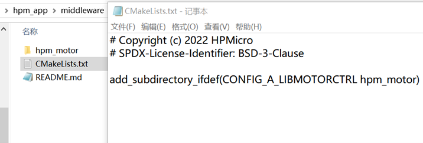
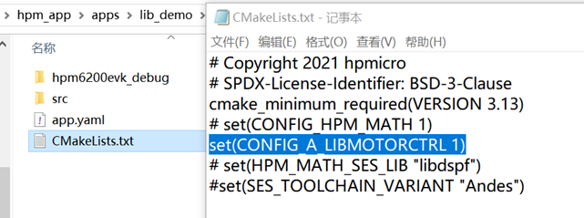
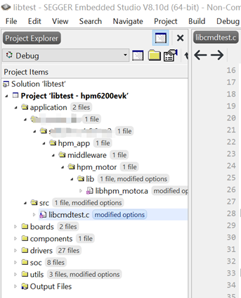
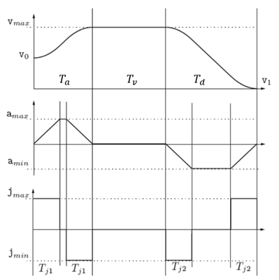
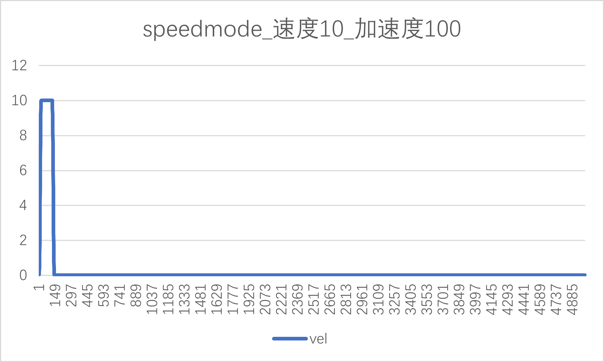
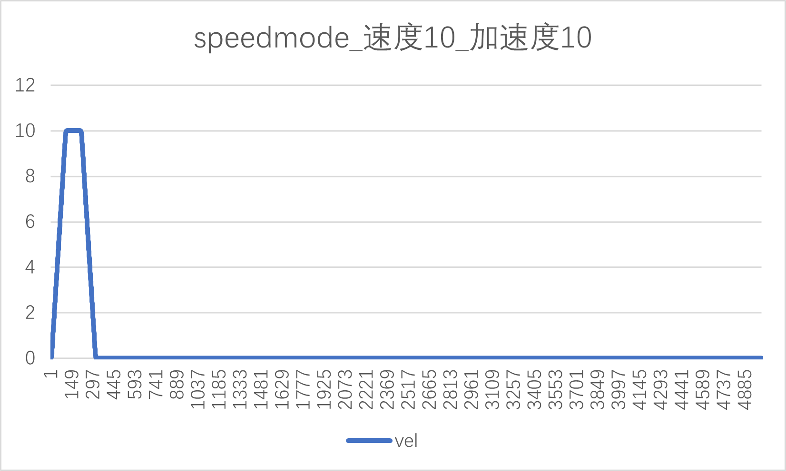
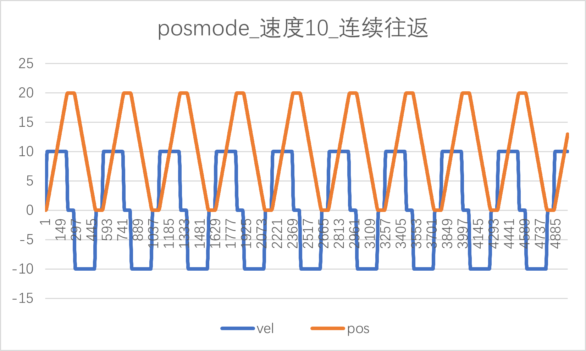
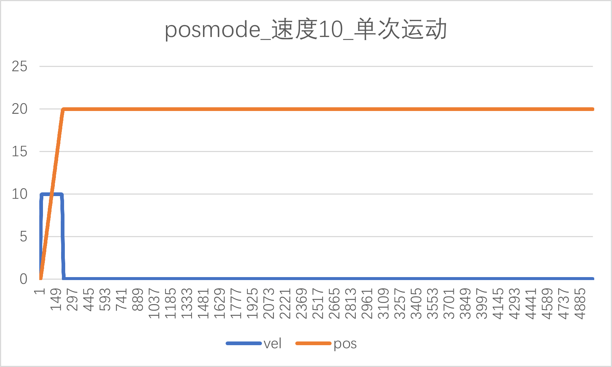
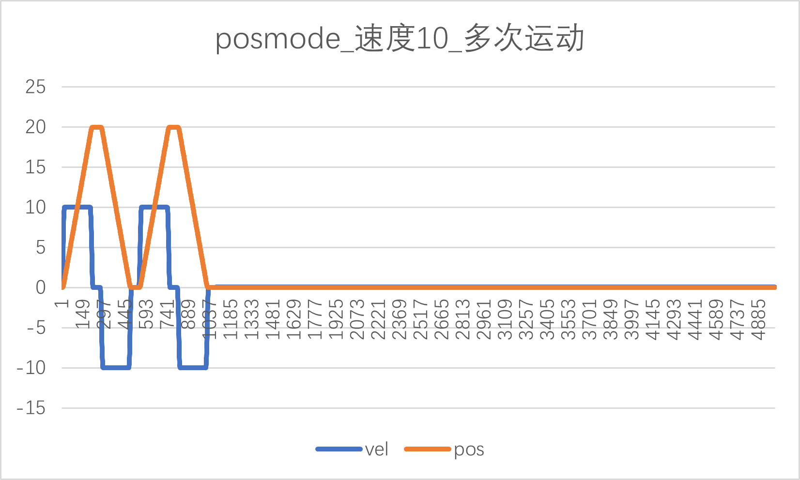

# hpm_motor库使用说明

(hpm_motor_instruction_zh)=

## 简介

hpm_motor是一个针对电机控制核心算法的库文件，该库旨在通过不断地更新完善，模块化管理具体功能算法；对用户来说不用去关心底层如何实现，加速用户程序开发。

该库目前仅支持在 windows 操作系统下使用。

## 库的添加

### 库内容

HPM电机库包含如下内容：

- 包含函数声明，宏声明，结构体声明的头文件

- 包含初始化配置函数和实时运行函数的.a文件

- 一个demo示例，展示HPM MOTOR库使用

- 文档

### 如何添加库

如需使用库里面的一些功能，请先将库添加工程下引用，具体引用流程如下：

（1）将hpm_motor文件添加到middleware分支下

（2）工程引用hpm_motor库

（3）新建工程，打开工程后可以看到hpm_motor库被工程引用

（4）工程编译

这里要说说明一下：hpm_motor 库文件使用，同时支持 gcc 以及 andes 工具链。

## 库功能说明

当前1.0版电机库，支持轨迹规划算法函数接口调用，其他算法功能会迭代更新完善。用户使用之前请先调用版本号函数接口获取版本号，与.a文件显示的版本号核对。

### 轨迹规划算法

电机在启停时，速度存在阶跃的情况。电机速度的突变可能会导致电流过载。所以通常用加减速控制算法来规划电机速度。

libhpm_motor.a中使用的轨迹规划算法是S型曲线，其核心是通过可变加加速度大小来控制加速度的变化，保证加速度不突变，使得加减速的速度曲线平滑，以此达到电机平稳运行的目的。

#### 功能简介

S型曲线主要由加速段（T_a），匀速段段（T_v），减速段（T_d）三大部分组成。加速段又分为加加速（T_j1）、匀加速、减加速（T_j1），减速度段分为加减速（T_j2）、匀减速和减减速（T_j2），一共七段如图1所示，其中，v_max为系统最大加速，v_0为起始速度，v_1为终止速度，a_max为系统最大加速度，a_min为系统最大减速度，j_max为系统最大加加速度，j_min为系统最大减减速度。

#### 接口说明

（1）入口参数

|        | 名称 | 说明 |
| ---- | ---- | ---- |
| 轨迹生成配置参数CMDGENE_INPUT_PARA | CMDGENE_POSCFG_PARA | 位置模式下 |
| 轨迹生成配置参数CMDGENE_INPUT_PARA | CMDGENE_VELCFG_PARA | 速度模式下 |
| 中间变量 | CMDGENE_USER_PARA |   |
| 输出变量 | CMDGENE_OUTPUT_PARA | 位置/速度/加速度/加速度序列 |

（2）结构体成员

|  结构体  |  | 描述 | 单位 |
| ---- | ---- | ---- |---- |
| CMDGENE_POSCFG_PARA | q0 | 起始位置  | uint |
| CMDGENE_POSCFG_PARA | q1 | 绝对运动位置 | uint |
| CMDGENE_POSCFG_PARA | v0 |  起始速度 一般设置为0 | uint/s|
| CMDGENE_POSCFG_PARA | v1 | 终止速度 一般设置为0 | uint/s|
| CMDGENE_POSCFG_PARA | vmax | 最大速度 | uint/s |
| CMDGENE_POSCFG_PARA | amax | 最大加速度 | uint/s/s |
| CMDGENE_POSCFG_PARA | jmax |  最大加加速度 | uint/s/s/s |
| CMDGENE_POSCFG_PARA | cyclecnt | 往返次数 |  |
| CMDGENE_POSCFG_PARA | cycletype |  运动类型 |  |
| CMDGENE_POSCFG_PARA | dwelltime | 往返停歇时间 | ms |
| CMDGENE_POSCFG_PARA | isr_time_s | 更新位置序列的中断时间 | s |
| CMDGENE_VELCFG_PARA | q0 | 起始位置  | uint |
| CMDGENE_VELCFG_PARA | Tv |  匀速时间 | s|
| CMDGENE_VELCFG_PARA | v0 |  起始速度 一般设置为0 | uint/s|
| CMDGENE_VELCFG_PARA | v1 | 终止速度 一般设置为0 | uint/s|
| CMDGENE_VELCFG_PARA | vmax | 最大速度 | uint/s |
| CMDGENE_VELCFG_PARA | amax | 最大加速度 | uint/s/s |
| CMDGENE_VELCFG_PARA | jmax |  最大加加速度 | uint/s/s/s |
| CMDGENE_VELCFG_PARA | isr_time_s | 更新位置序列的中断时间 | s |
| CMDGENE_OUTPUT_PARA | poscmd | 位移指令 | uint|
| CMDGENE_OUTPUT_PARA | velcmd | 速度指令 | uint/s|
| CMDGENE_OUTPUT_PARA | acccmd | 加速度指令 | uint/s/s |

**注：单位uint一般为r，count**

（3）函数接口

|  函数接口名称  | 说明 | 调用状态 |
| ---- | ---- | ---- |
| pos_cmd_gene | 位置模式下，位置/速度序列更新 | 中断函数内调用 |
| vel_cmd_gene | 速度模式下，速度序列更新 | 中断函数内调用 |
| cmd_gene_disable | 轨迹规划重置 |  轨迹规划结束后重置 |

#### 使用方法

轨迹规划算法分为五步：

Step1：添加库头文件。C头文件“libhpm_motor.h”包含库使用的函数声明和结构体声明。在主C文件的顶部添加以下行:

#include “libhpm_motor.h”

.h文件在hpm_app\middleware\hpm_motor\inc下。

Step2：在”{ProjectName}-Main.c”文件中定义轨迹规划结构体全局变量。

CMDGENE_PARA cmdpar=0;

Step3：用户根据运行模式，运动方式，运动参数对配置参数结构体的各成员赋值

    cmdpar.cmdgene_in_par.poscfgpar.q0 = 0;
    cmdpar.cmdgene_in_par.poscfgpar.q1 = 20;
    cmdpar.cmdgene_in_par.poscfgpar.v0 = 0;
    cmdpar.cmdgene_in_par.poscfgpar.v1 = 0;
    cmdpar.cmdgene_in_par.poscfgpar.vmax = 10;
    cmdpar.cmdgene_in_par.poscfgpar.amax = 100;
    cmdpar.cmdgene_in_par.poscfgpar.jmax = 1000;
    cmdpar.cmdgene_in_par.poscfgpar.cyclecnt = 1
    cmdpar.cmdgene_in_par.poscfgpar.cycletype = 0;
    cmdpar.cmdgene_in_par.poscfgpar.dwelltime = 500;
    cmdpar.cmdgene_in_par.poscfgpar.isr_time_s = 1;

    cmdpar.cmdgene_in_par.velcfgpar.q0 = 0;
    cmdpar.cmdgene_in_par.velcfgpar.Tv = 5;
    cmdpar.cmdgene_in_par.velcfgpar.v0 = 0;
    cmdpar.cmdgene_in_par.velcfgpar.v1 = 0;
    cmdpar.cmdgene_in_par.velcfgpar.vmax =10;
    cmdpar.cmdgene_in_par.velcfgpar.amax = 100;
    cmdpar.cmdgene_in_par.velcfgpar.jmax = 1000;
    cmdpar.cmdgene_in_par.velcfgpar.isr_time_s = 1;

 Step4：根据运行模式在中断内分别调用对应轨迹规划函数

速度模式下，调用函数vel_cmd_gene

位置模式下，调用函数 pos_cmd_gene

Step5：轨迹规划重置

cmd_gene_disable

调用该函数重置轨迹规划中间变量，以便再次对用户指定的PTP运动的起点，终点，速度规划算法。

#### 配置示例

为了方便大家更快捷的对此功能了解使用，这里记录了一些基础配置下速度曲线，位置曲线供大家参考，具体如下表所示。

| 运行模式 | 绝对位置r | 速度r/s | 加速度r/s/s | 加加速度r/s/s/s | 匀速时间s | 运动模式 | 运行次数 | 中断 | 示意图 |
| ---- | ---- | ---- |---- |---- | ---- | ---- |---- |--- |---- |
| 速度 | 0 | 10 | 100 | 1000 | 10 | / | / |1ms | 图1 |
| 速度 | 0 | 10 | 10 | 100 | 10 | / | / |1ms | 图2 |
| 位置 | 20 | 10 | 100 | 1000 | / | 0：连续 |  / |1ms | 图3 |
| 位置 | 20 | 10 | 100 | 1000 | / |  1：单次 | / |1ms | 图4 |
| 位置 | 20 | 10 | 100 | 1000 | / |  2：多次 | 2 |1ms | 图5 |

- 图1

- 图2

- 图3

- 图4

- 图5

### 惯量辨识算法
为达到伺服控制系统的良好动静态特性，需要辨识出转动惯量，对系统控制参数进行调整。本库主要是为了说明惯量辨识原理、实现方式，原理请查看：[《hpm_motor库使用说明2.0》](doc/hpm_motor库使用说明2.0.pdf)

该库函数使用步骤：
1、使用前，电机需要设置为速度模式，需要对INTERIA_CalHdl的相关变量赋值：
  INTERIA_CalHdl.INTERIA_InObj.flux = 永磁磁链幅值;//单位Wb

  INTERIA_CalHdl.INTERIA_InObj.vel1 = 0.0000167*第一加速阶段最大速度（单位，r/min）;//可设置为350r/min

  INTERIA_CalHdl.INTERIA_InObj.cycle = 10;//辨识过程一共10次连续加减速

  INTERIA_CalHdl.INTERIA_InObj.interia_start = 1;//1：启动惯量辨识，0：不启动惯量辨识

  INTERIA_CalHdl.INTERIA_InObj.kk = 4;//第二阶段的加速度是第一阶段加速度的KK倍

  INTERIA_CalHdl.INTERIA_InObj.step = 500；//单位ms，每段加速时间500ms

  INERTIA_CalObj.INTERIA_InObj.iq = 三相永磁同步电机Q轴反馈电流;//单位：A

  INERTIA_CalObj.INTERIA_InObj.speed_fdk = 反馈速度;//单位，r/s

  INERTIA_CalObj.INTERIA_InObj.poles = 三相永磁同步电机极对数;//

2、函数调用：interia_cal_process(&INERTIA_CalObj)；

3、指令速度 = INERTIA_CalObj.INTERIA_UserObj.Vel_out*1000；//单位r/s

4、惯量结果存放变量：INTERIA_CalHdl->INTERIA_OutObj.J，单位（𝑘𝑔 ∙ 𝑚2）。//前提是惯量辨识已经结束，即INERTIA_CalObj.INTERIA_OutObj.status = 0。

## API

:::{eval-rst}

关于软件API 请查看 `方案API 文档 <../../_static/middleware/hpm_motor/html/index.html>`_ 。
:::