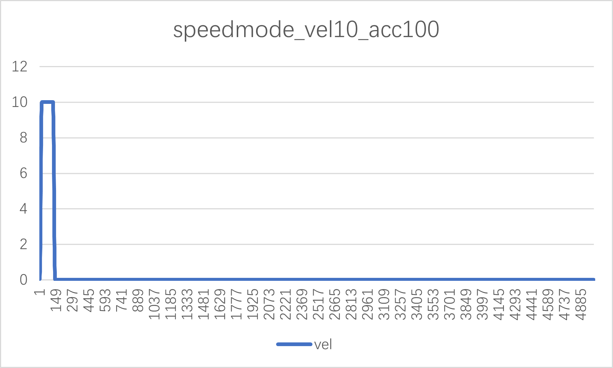
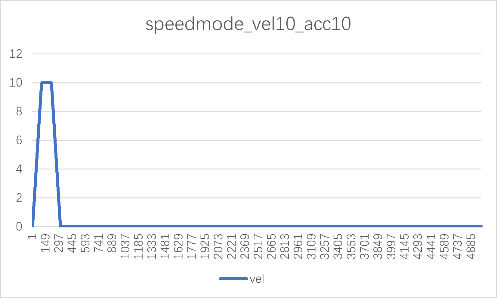
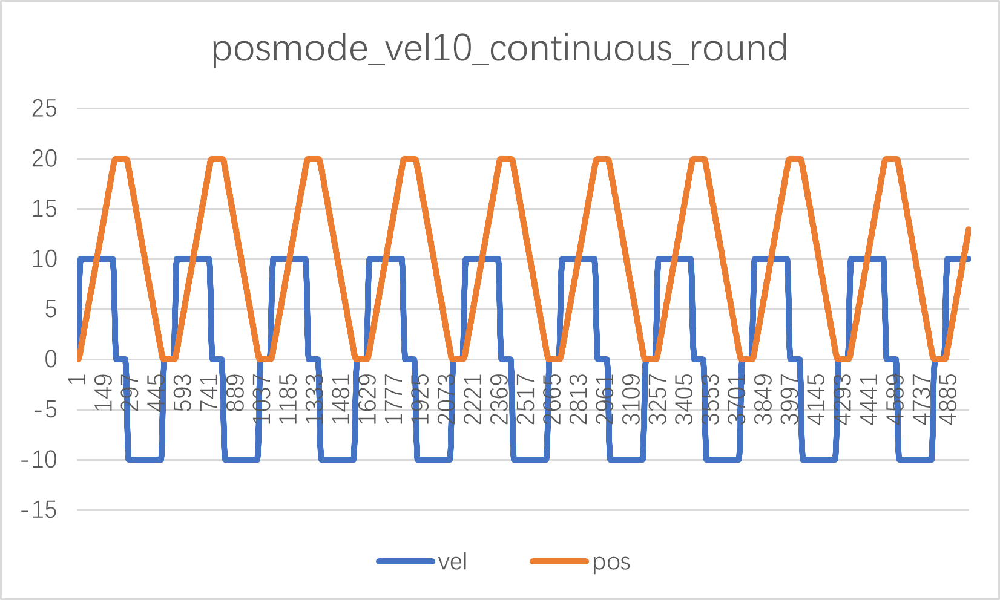
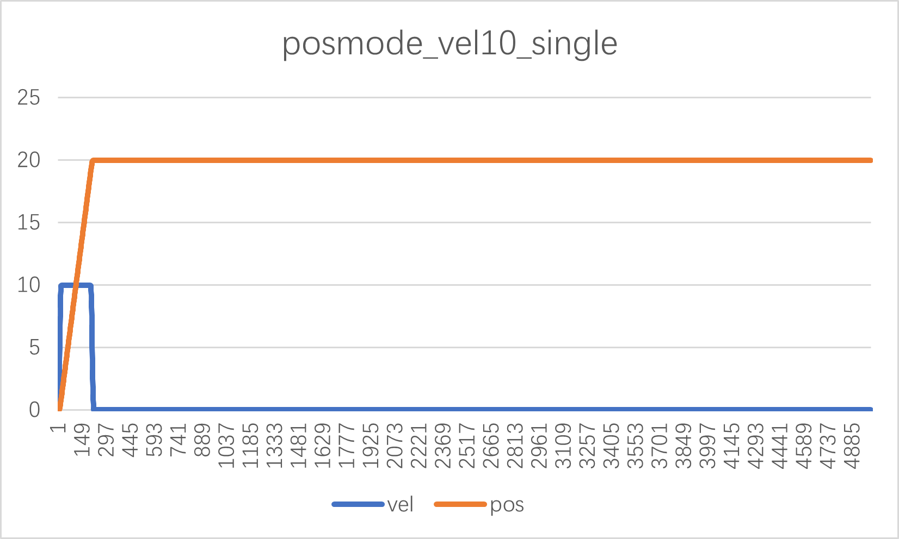
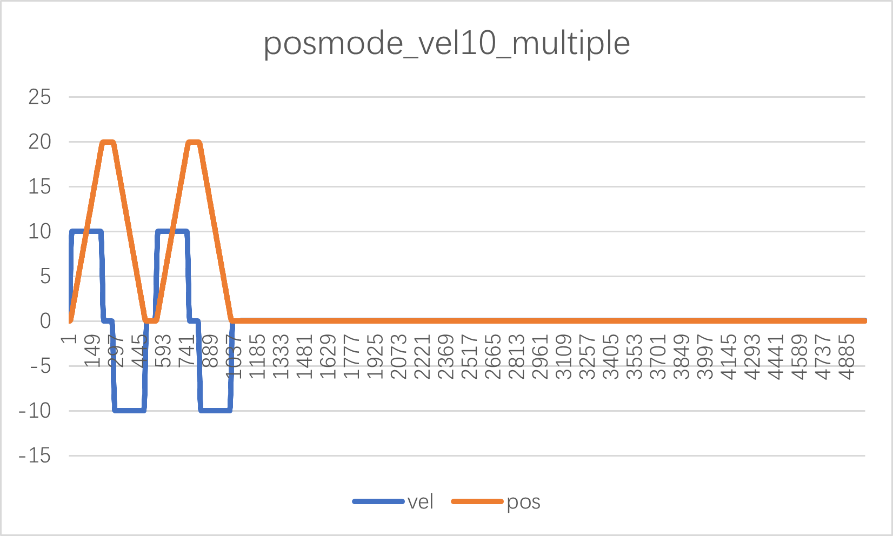

# hpm_motor LIB USER GUIDE

(hpm_motor_instruction_en)=

## overview

hpm_motor is a library file for the core algorithm of motor control, which aims at modularized management of specific functional algorithms by constantly updating and improving; For users do not have to care about how to implement the underlying, accelerate the development of user programs.

The library is currently only supported for use in windows operating systems.

## Installing the HPM MOTOR Library

### hpm_motor library package contents

The Motor library consists of the following components:

- Header file containing function declaration, macro declaration, structure declaration

- Contains the.a file of the initial configuration function and the real-time running function

- A demo example showing the use of HPM MOTOR library

- Document

### How to Install the HPM MOTOR Library

If you need to use some of the functions in the library, please first add the library to the project reference, the specific reference process is as follows:

（1）add the hpm motor file under the middleware branch

（2）project cite hpm motor library

（3）After opening the new project, you can see that the hpm_motor library is referenced by the project

（4）build project

The hpm_motor library file is used, and both gcc and andes toolchains are supported.

## Library function description

The current 1.0 version of the library supports trajectory planning algorithm function interface calls, and other algorithm functions will be iteratively updated and improved. Before use, please call the version number function interface to obtain the version number and check with the version number displayed in the.a file.

### Trajectory planning algorithm

There is a step in the speed of the motor when it is started and stopped. A sudden change in motor speed can cause current overload. Therefore, the acceleration and deceleration control algorithm is usually used to plan the motor speed.

The trajectory planning algorithm used in libhpm_motor.a is an S-shaped curve, the core of which is to control the change of acceleration through variable acceleration, ensure that acceleration does not mutate, and smooth the acceleration and deceleration speed curve, so as to achieve the purpose of smooth operation of the motor.

#### function 

The S-shaped curve is mainly composed of acceleration section (T_a), uniform velocity section (T_v) and deceleration section (T_d). The acceleration section is further divided into acceleration (T_j1), uniform acceleration and deceleration (T_j1), and the deceleration section is divided into acceleration and deceleration (T_j2), uniform deceleration and deceleration (T_j2). There are seven sections in total, as shown in Figure 1, where v_max is the maximum acceleration of the system, v_0 is the start speed, v_1 is the end speed, and a_max is the maximum acceleration of the system. a_min is the maximum deceleration of the system, j_max is the maximum acceleration of the system, and j_min is the maximum deceleration of the system.

#### API description

（1）parameter

|        | name | note | 
| ---- | ---- | ---- |
| Trajectory generation configuration parameters CMDGENE_INPUT_PARA | CMDGENE_POSCFG_PARA | position mode |
| Trajectory generation configuration parameters CMDGENE_INPUT_PARA | CMDGENE_VELCFG_PARA | velocity mode | 
| user variable | CMDGENE_USER_PARA |   |
| output params | CMDGENE_OUTPUT_PARA | pos/vel/acc/jerk array|

（2）structure member

|  structure  |  | note | unit |
| ---- | ---- | ---- |---- |
| CMDGENE_POSCFG_PARA | q0 | start position | unit |
| CMDGENE_POSCFG_PARA | q1 | absolute position | unit |
| CMDGENE_POSCFG_PARA | v0 |  start velocity ,set to 0 | unit/s|
| CMDGENE_POSCFG_PARA | v1 | end velocity ,set to 0 | unit/s|
| CMDGENE_POSCFG_PARA | vmax | max velocity | unit/s |
| CMDGENE_POSCFG_PARA | amax | max acc | unit/s/s |
| CMDGENE_POSCFG_PARA | jmax |  max jerk | unit/s/s/s |
| CMDGENE_POSCFG_PARA | cyclecnt | cycle count |  |
| CMDGENE_POSCFG_PARA | cycletype |  motion type |  |
| CMDGENE_POSCFG_PARA | dwelltime | dwell time | ms |
| CMDGENE_POSCFG_PARA | isr_time_s | The interrupt time for update position | s |
| CMDGENE_VELCFG_PARA | q0 | start position  | unit |
| CMDGENE_VELCFG_PARA | Tv |  constant speed | s|
| CMDGENE_VELCFG_PARA | v0 |  start velocity ,set to 0 | unit/s|
| CMDGENE_VELCFG_PARA | v1 | end velocity ,set to 0| unit/s|
| CMDGENE_VELCFG_PARA | vmax | max velocity | unit/s |
| CMDGENE_VELCFG_PARA | amax | max acc  | unit/s/s |
| CMDGENE_VELCFG_PARA | jmax |  max jerk | unit/s/s/s |
| CMDGENE_VELCFG_PARA | isr_time_s | The interrupt time for update velocity | s |
| CMDGENE_OUTPUT_PARA | poscmd | pos cmd | unit|
| CMDGENE_OUTPUT_PARA | velcmd | vel cmd | unit/s|
| CMDGENE_OUTPUT_PARA | acccmd | acc cmd | unit/s/s |

**note：uint set as r，count**

（3）API

|  name  | note | call state | 
| ---- | ---- | ---- |
| pos_cmd_gene | position mode，update pos/vel array | called in isr | 
| vel_cmd_gene | speed mode，updatevel array | called in isr | 
| cmd_gene_disable | reset trajectory planning | reset after trajectory planning end | 

#### Steps to use the HPM MOTOR library

The trajectory planning algorithm is divided into five steps:

Step1: Add library headers. The C header file "libhpm_motor.h" contains the function declarations and structure declarations used by the library. Add the following line at the top of the main C file:

#include “libhpm_motor.h”

The.h file is under hpm_apps\middleware\hpm_motor\inc.

Step2: Define the trajectory planning structure global variable in the {ProjectName}-Main.c file.

CMDGENE_PARA cmdpar=0;

Step3: The user assigns values to each member of the configuration parameter structure according to the operation mode, motion mode and motion parameter

    cmdpar.cmdgene_in_par.poscfgpar.q0 = 0;
    cmdpar.cmdgene_in_par.poscfgpar.q1 = 20;
    cmdpar.cmdgene_in_par.poscfgpar.v0 = 0;
    cmdpar.cmdgene_in_par.poscfgpar.v1 = 0;
    cmdpar.cmdgene_in_par.poscfgpar.vmax = 10;
    cmdpar.cmdgene_in_par.poscfgpar.amax = 100;
    cmdpar.cmdgene_in_par.poscfgpar.jmax = 1000;
    cmdpar.cmdgene_in_par.poscfgpar.cyclecnt = 1
    cmdpar.cmdgene_in_par.poscfgpar.cycletype = 0;
    cmdpar.cmdgene_in_par.poscfgpar.dwelltime = 500;
    cmdpar.cmdgene_in_par.poscfgpar.isr_time_s = 1;

    cmdpar.cmdgene_in_par.velcfgpar.q0 = 0;
    cmdpar.cmdgene_in_par.velcfgpar.Tv = 5;
    cmdpar.cmdgene_in_par.velcfgpar.v0 = 0;
    cmdpar.cmdgene_in_par.velcfgpar.v1 = 0;
    cmdpar.cmdgene_in_par.velcfgpar.vmax =10;
    cmdpar.cmdgene_in_par.velcfgpar.amax = 100;
    cmdpar.cmdgene_in_par.velcfgpar.jmax = 1000;
    cmdpar.cmdgene_in_par.velcfgpar.isr_time_s = 1;

Step4: Call the corresponding trajectory planning function in the interrupt according to the running mode

In speed mode, the function vel_cmd_gene is called

In position mode, the function pos_cmd_gene is called

Step5: Reset trajectory planning

cmd_gene_disable

Call this function to reset the trajectory planning intermediate variable in order to once again plan the starting point, end point, and velocity of the PTP motion specified by the user.

#### config demo

In order to facilitate the use of this function more quickly, here is a record of some basic configuration under the speed curve, position curve for your reference, as shown in the following table.

| operation mode | absloute pos r | vel r/s | acc r/s/s | jerk r/s/s/s | Tv s | motion type | cycle cnt | isr | fig | 
| ---- | ---- | ---- |---- |---- | ---- | ---- |---- |--- |---- |
| speed | 0 | 10 | 100 | 1000 | 1 | / | / |1ms | fig1 |
| speed | 0 | 10 | 10 | 100 | 1 | / | / |1ms | fig2 |
| position | 20 | 10 | 100 | 1000 | / | 0：continous |  / |1ms | fig3 |
| position | 20 | 10 | 100 | 1000 | / |  1：single | / |1ms | fig4 |
| position | 20 | 10 | 100 | 1000 | / |  2：multiple | 2 |1ms | fig5 |

- fig1

- fig2

- fig3

- fig4

- fig5

## Licensing

HPM APP is permissively licensed using the BSD 3-clause license.