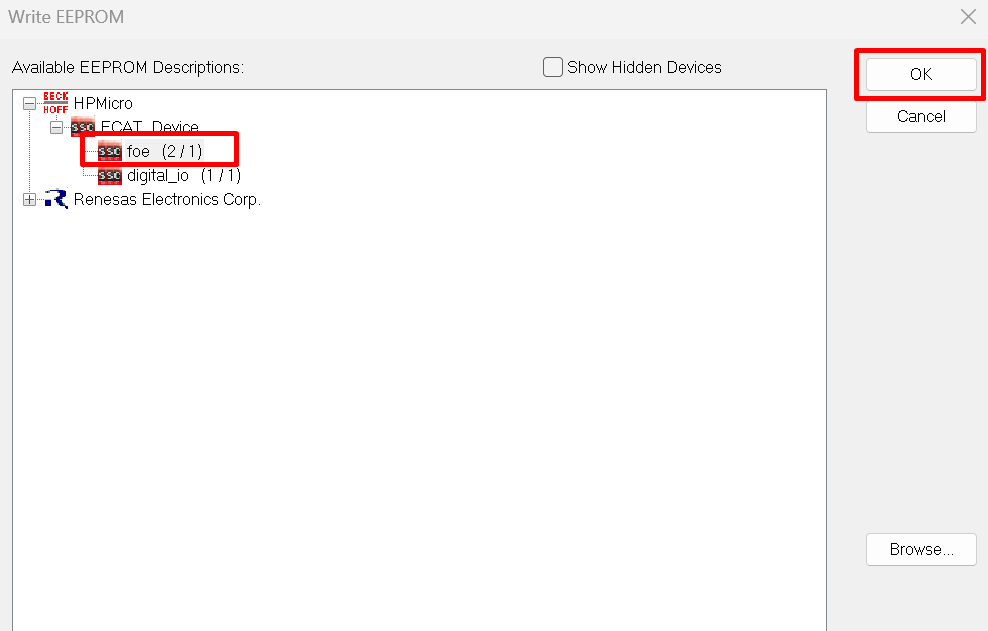
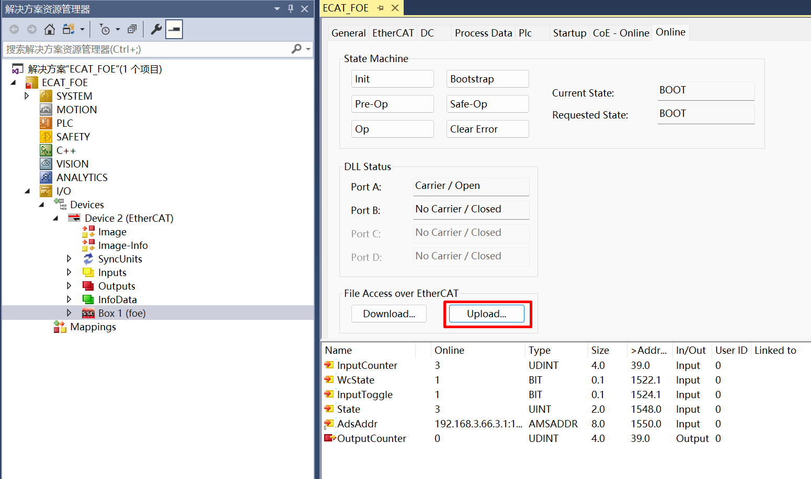

# ECAT_FOE

## 1. Overview

The ECAT_FOE example demonstrates the functionality of ECAT FOE to write and read slave files.

Using ECAT FOE to update firmware, please refer to the OTA sample in hpm_apps repo.

hpm_apps repo：
  github: https://github.com/hpmicro/hpm_apps
  gitee: https://gitee.com/hpmicro/hpm_apps

## 2. Prepare

  Please refer to the README of ECAT_IO sample

## 3. Project Setting

  Please refer to the README of ECAT_IO sample

## 4. Generate EtherCAT slave stack code

Due to licensing issues, HPMSDK does not provide EtherCAT slave protocol stack code (SSC). Users have download the SSC Tool from Beckoff's official website and generate the slave stack code according to the steps.

### 4.1. Download SSC Tool

  Please refer to the README of ECAT_IO sample

### 4.2 SSC Tool import configuration files
  configuration file path: SSC/Config/HPM_ECAT_FOE_Config.xml

### 4.3 SSC Tool create new project
  application file path: SSC/foe.xlsx

### 4.4 Create slave stack files
  stack code output path: SSC/Src

## 5. TwinCAT Project setting
  Please refer to the README of ECAT_IO sample

### 5.1. Add ESI file
  ESI file name: ECAT_FOE.xml

### 5.2 Create Project
  Please refer to the README of ECAT_IO sample

### 5.3 Software Configuration
  Please refer to the README of ECAT_IO sample

### 5.4 Scan device
  Please refer to the README of ECAT_IO sample

### 5.5 Update EEPROM context
  select **foe**
  


### 5.6 FOE action
  1. Set MailBox timeout time (when the file is large, the timeout time needs to be adjusted)
  
  2. Enter Bootstrap mode
  
  3. Download file
    click 'Download'
    
    select file to download. Note: This file is the file after the script is signed (update_sign.bin)
    
    edit file name and password， file name：**app**; pass word：**87654321**.
    
    waiting for completion of writing
  4. Enter Bootstrap mode，uploade file
    click 'Uplaod'
    
    select file name and path
    
    edit file name and password， file name：**app**; pass word：**87654321**. (Note: the file name and password are fixed)
    
    waiting for completion of reading
    (Note: After the download is complete, it will not reboot immediately, you need to exit Bootstrap mode to reboot and jump to the new firmware).
  4. quit Bootstrap mode

## 6. Running the example

After the project is running correctly：
When the EEPROM is not initialized, the following message is output indicating the need to initialize the contents of the EEPROM.
```console
EtherCAT FOE sample
Write or Read file from flash by FOE
EEPROM loading with checksum error.
EtherCAT communication is possible even if the EEPROM is blank(checksum error),
but PDI not operational, please update eeprom  context.
```
After the EEPROM is properly initialized, the following information is output, which can be used for file write and read operations in Twincat, comparing the written and read files to ensure consistency.
```console
EtherCAT IO sample
Write or Read file from flash by FOE
EEPROM loading successful, no checksum error.
```
Firmware download in progress
```console
EEPROM loading successful, no checksum error.
Write file start
ota0, device:0x0048504D, length:85416, version:1728558561, hash_type:0x00000004
ota0 data download...
complete checksum and reset!

ota success!

Write file finish
```

Exit Bootstrap mode and reboot to jump to the new firmware running
```console
system reset...

----------------------------------------------------------------------
$$\   $$\ $$$$$$$\  $$\      $$\ $$\
$$ |  $$ |$$  __$$\ $$$\    $$$ |\__|
$$ |  $$ |$$ |  $$ |$$$$\  $$$$ |$$\  $$$$$$$\  $$$$$$\   $$$$$$\
$$$$$$$$ |$$$$$$$  |$$\$$\$$ $$ |$$ |$$  _____|$$  __$$\ $$  __$$\
$$  __$$ |$$  ____/ $$ \$$$  $$ |$$ |$$ /      $$ |  \__|$$ /  $$ |
$$ |  $$ |$$ |      $$ |\$  /$$ |$$ |$$ |      $$ |      $$ |  $$ |
$$ |  $$ |$$ |      $$ | \_/ $$ |$$ |\$$$$$$$\ $$ |      \$$$$$$  |
\__|  \__|\__|      \__|     \__|\__| \_______|\__|       \______/
----------------------------------------------------------------------
boot user

ver1:1728558561,ver2:1726018801

APP0, verify SUCCESS!

APP index:0
hello world, THIS OTA0
ECAT FOE Funcation
EEPROM loading successful, no checksum error.

```


